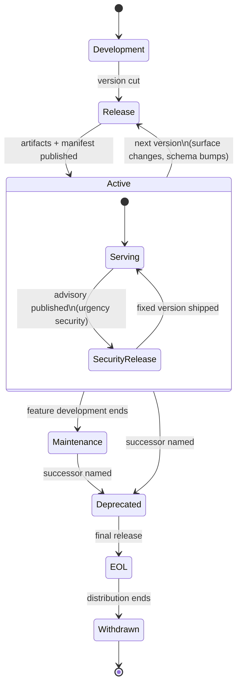
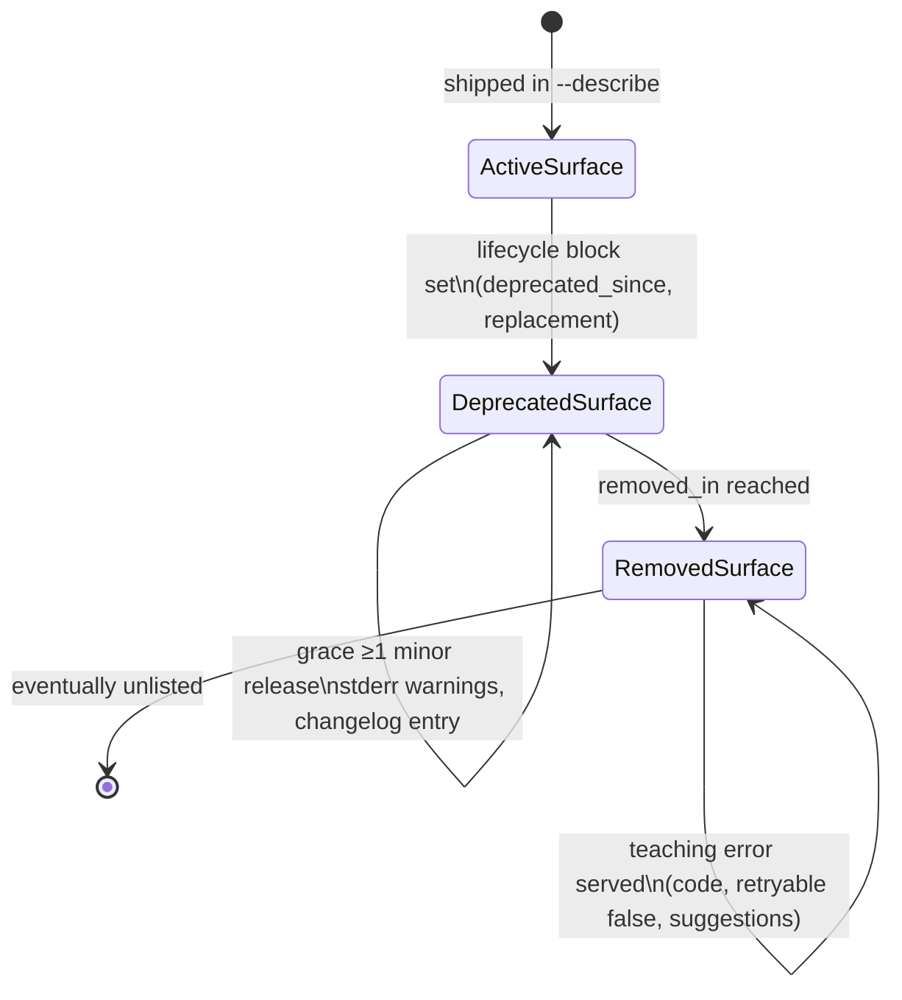

# Miri Artifact Lifecycle: Command-Line Tools

*Specification Version: 0.2-draft*
*Status: Draft*
*Created: 2026*

## Overview

Every stage a Miri-compliant CLI moves through, from first release to end-of-life — with the metadata state each stage
requires, the signal consumers see, and the standard each transition derives from. Two state machines compose: the
**artifact lifecycle** (the tool as a whole) and, nested inside its active years, the **surface lifecycle** (individual
flags and subcommands deprecating independently — see [CLI Spec §6](cli-lifecycle-specification.md)).

## The Artifact Lifecycle

## Stage Definitions

| Stage | `support.status` | What happens to metadata | What consumers see | Standards |
|---|---|---|---|---|
| **1. Development** | — (unreleased) | Command surface authored as schema-as-data; `lifecycle` blocks added as flags evolve | Nothing — not yet released | [CLI Spec §2.3](cli-lifecycle-specification.md) |
| **2. Release** | `active` | One schema struct derives `--help`, `--describe`, `changelog`; SBOM generated (non-Go binaries); release manifest updated; `SKILL.md` regenerated from the binary; linter scores the build | The Miri score gates release in CI; the manifest advertises the new version | [CLI Spec §3/§5](cli-lifecycle-specification.md) / [Checklist](linter-checklist.md) / [Landscape §4.5](landscape-and-prior-art.md) |
| **3. Active** | `active` | `check-update` serves latest; `changelog --since` answers "what moved"; advisories attach via OSV; surfaces deprecate per the nested lifecycle below | Full Miri surface: identity, advisory join, update state, per-flag lifecycle | [CLI Spec §4–6](cli-lifecycle-specification.md) / [OSV](https://ossf.github.io/osv-schema/) |
| **4. Maintenance** | `maintenance` | Security fixes only; `supported_versions` narrows; deprecations accumulate ahead of the successor | Agents see reduced-support signal from `--describe` before adopting the tool | [CLI Spec §3.2](cli-lifecycle-specification.md) |
| **5. Deprecated** | `deprecated` | `support.replacement` set (successor purl or absorbing subcommand); final releases carry updated `support`; `check-update` keeps pointing forward | Every `--describe` call teaches the successor — reaching even consumers working from frozen weights, at call time | [CLI Spec §3.2](cli-lifecycle-specification.md) |
| **6. EOL** | `eol` | Terminal release; manifest's final entry marks EOL; advisories may still be filed | Consumers treat any use as a finding; OpenEoX statement once ratified | [CLI Spec §3.2](cli-lifecycle-specification.md) / [OpenEoX](https://www.oasis-open.org/tc-openeox/) |
| **7. Withdrawn** | `eol` | Distribution channel ends (registry deprecation message, archived releases); manifest remains readable as the historical record | Installers warn (`npm deprecate`-style where the channel supports it) | [Signaling §2](update-and-vulnerability-signaling.md) |

## Cross-Cutting Events (any released stage)

| Event | Mechanism | Effect | Standards |
|---|---|---|---|
| **Advisory published** | Home database (GHSA / ecosystem DB) → OSV, against the CLI's purl | `check-update` flips to `urgency: security`; fleet policy can refuse to run affected versions | [CLI Spec §5.1/§8.4](cli-lifecycle-specification.md) |
| **Wire schema bump** | `schema_version` increments independently of release version | Consumers pin or negotiate; the payload contract moves on its own clock | [CLI Spec §3.1](cli-lifecycle-specification.md) / [Landscape §3.3](landscape-and-prior-art.md) |
| **Skill regeneration** | `agent-context --write`-style command re-derives `SKILL.md` | Upgrade re-teaches every agent in the repo; the diff surfaces in code review | [Landscape §4.5](landscape-and-prior-art.md) |

## The Nested Surface Lifecycle

Inside stages 3–5, individual flags and subcommands move through their own three-state machine:

Transition requirements (enforced by [coherence checks MIRI-CLI-031…038](linter-checklist.md)):

1. **Active → Deprecated**: `lifecycle` block set (`deprecated_since`, `removed_in`, `replacement`, `migration` — the
   [RFC 9745](https://www.rfc-editor.org/info/rfc9745/) /[8594](https://www.rfc-editor.org/info/rfc8594/) two-phase
   shape); the deprecating release's `changelog --since` records it; warnings go to stderr only.
2. **Deprecated (holding)**: functions for ≥1 minor release ([K8s
   policy](https://kubernetes.io/docs/reference/using-api/deprecation-policy/) shape) so live introspection and
   skill-regeneration cycles observe it before breakage.
3. **Deprecated → Removed**: only at/after `removed_in`; the surface then serves the **structured teaching error** —
   converting an agent's stale-weights invocation into a one-turn recovery. **Removal without a prior Deprecated state
   is a conformance failure** (no silent removals, MIRI-CLI-037).

## The Three Clocks

Throughout the lifecycle, three versions advance independently (see [Landscape §5](landscape-and-prior-art.md)): the
**release version**, the **wire schema version** (`schema_version`), and — for CLIs fronting services — the **backing
API version**. Collapsing any two loses the ability to change one without a major bump in the other.

## PDF

A diagrammed PDF rendering is committed at
[assets/miri-cli-artifact-lifecycle.pdf](../../assets/miri-cli-artifact-lifecycle.pdf). This markdown is the source of
truth; regenerate the PDF when it changes.

## Companion

- [Python Artifact Lifecycle](../python/artifact-lifecycle.md)
