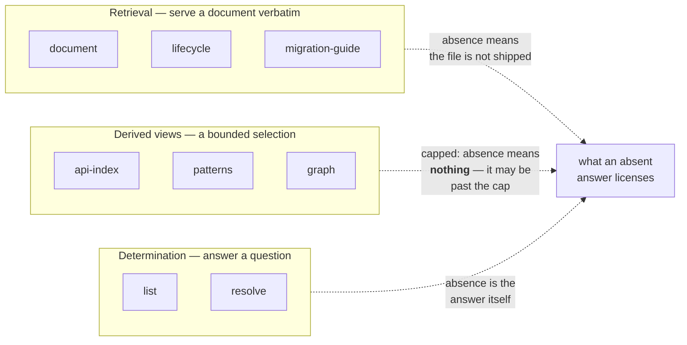
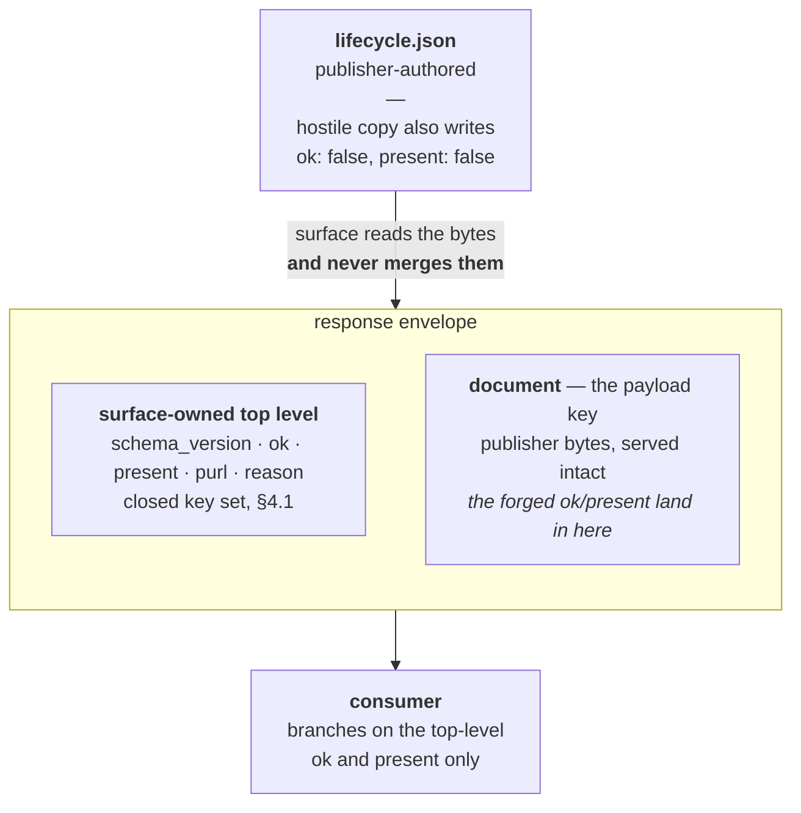
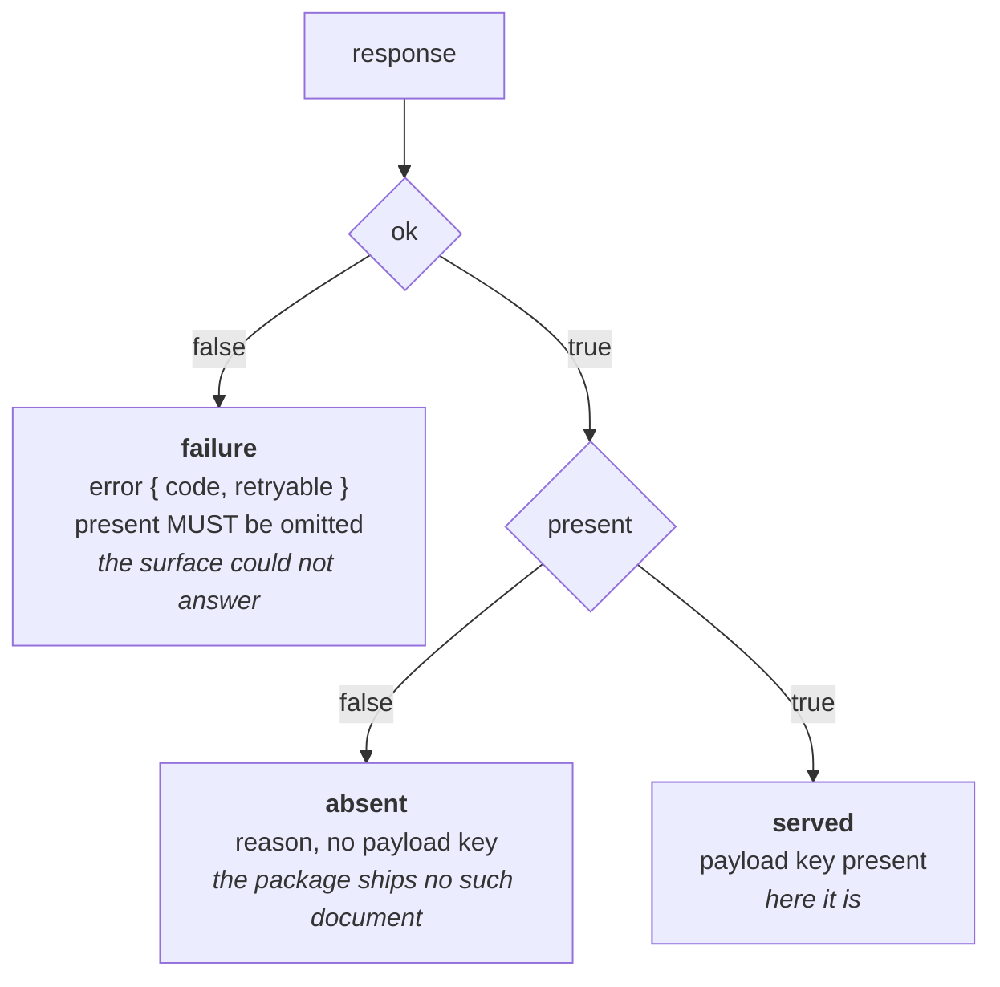

# Miri Standard: Discovery Contract (Consumption)

*Specification Version: 0.3-draft*
*Status: Draft*
*Created: 2026*

## Abstract

The producer standards define the `agent-metadata/` directory an artifact ships. This specification defines how an
agent **obtains** that metadata at the moment it is deciding what to call: a **transport-agnostic metadata-query
contract** of eight read-only operations — retrieval (`document`, with `lifecycle` and `migration-guide`
shorthands), derived views (`api-index`, `patterns`, `graph`), and determination (`list`, `resolve`) — of which an
**MCP context server** is the first binding. The contract adds the wire discipline the producer surfaces already carry:
a **surface-owned response envelope** that versions and frames every answer without reshaping the publisher's bytes, a
structured **absence-versus-error** discriminator that a hostile package cannot forge, and **import-free discovery** so
that a hostile or broken package never executes during lookup.

This document specifies *mechanism*, not benefit. Whether decision-time consumption improves agent outcomes is an
empirical question gated on the pre-registered experiment; no clause here asserts effectiveness.

## Table of Contents

1. [Problem Statement](#1-problem-statement)
2. [Design Principles](#2-design-principles)
3. [The Metadata-Query Contract](#3-the-metadata-query-contract)
4. [The Response Envelope](#4-the-response-envelope)
5. [Import-Free Discovery](#5-import-free-discovery)
6. [The MCP Binding](#6-the-mcp-binding)
7. [Project Declaration](#7-project-declaration)
8. [Discovery Measurement](#8-discovery-measurement)
9. [Security Considerations](#9-security-considerations)
10. [Conformance](#10-conformance)

---

## 1. Problem Statement

The metadata ships inside the wheel, but shipping is not reaching. An agent deciding which method to call, whether a
package is deprecated, or how to migrate a call site needs that metadata **at decision time**, in its context, without
first knowing the file layout or spending turns spelunking the installed tree. Three delivery vehicles exist:

1. **In-wheel** — the agent opens `agent-metadata/*.json` directly. Requires the agent to know the path and to have
   filesystem access to site-packages.
2. **In-process** — the package's `_miri` discovery functions (Wheel Extensions §6) return the metadata to code
   running inside the same interpreter.
3. **Context server** — a process that serves the metadata to the agent over a tool surface, so it arrives as
   structured tool output at decision time without file spelunking.

The context server is the decision-time vehicle, and a reference implementation exists (`miri mcp`). But **a server's
behavior is not a contract**: without a specified wire shape, two implementations diverge and a consumer built against
one breaks against the other. This document defines the contract those implementations must share, and binds it to
MCP as the first transport.

A consumer reading through vehicle 1 or 2 reads the producer documents directly and is governed by the producer
standards. **This contract governs vehicle 3**, and the [Consumption Map](consumption-map.md) labels each of its
read-steps with the vehicle that supplies it, so that no reading order depends on a document no operation can serve.

## 2. Design Principles

- **Declare sources, not verdicts.** A query returns the package's declared metadata; the consumer computes any
  verdict (vulnerable? current? safe to call?) at call time.
- **Metadata is untrusted input.** Every payload is publisher-authored data, never instructions; it inherits the
  threat model in full (§9).
- **The surface owns the envelope; the publisher owns the payload.** Every response is a surface-authored envelope
  with the publisher's bytes nested inside it (§4). The two never share a namespace, so no publisher can forge a
  surface signal.
- **Pointers, not dumps.** Routing answers are context-budgeted: capped, filterable, and pointing into the source
  rather than reproducing it. The saving this yields is a **function of the ratio between a package's source size and
  its metadata size**, and is therefore largest on big packages and small — occasionally negative — on tiny ones. No
  clause of this standard asserts a particular saving; where one is claimed it must be measured on the package in
  question.
- **Import-free discovery.** Locating a package's metadata MUST NOT import or execute the package (§5).
- **One shape across bindings.** The operations and their envelopes are defined independently of transport; MCP is one
  binding, and any future binding carries the same operations and the same envelopes (§6).

## 3. The Metadata-Query Contract

A conformant metadata-query surface exposes these eight read-only operations and **MUST NOT expose any other
operation on the same surface** — the prohibition is stated here rather than only argued in §9, because every added
operation is reachable by whatever can reach these eight and inherits none of their analysis. A surface that also
needs to offer unrelated tools offers them elsewhere. Each is defined by its
input, its payload, and its semantics; every response is wrapped in the §4 envelope.

The eight fall into three kinds, and the kind determines what a consumer may conclude from an answer:



The distinction is load-bearing rather than taxonomic. A derived view is **capped**, so a symbol missing from an
`api-index` response may simply be past the cap — which is why `resolve`, a determination, exists to settle symbol
existence and why no consumer may settle it from index membership (§3.5).

| Operation | Input | Payload key | Serves |
|---|---|---|---|
| `list` | optional `query`, `limit`, `cursor` | `packages` | Which installed packages ship agent-metadata, and which documents each has |
| `document` | `package`, `name` | `document` | Any single whitelisted agent-metadata document, verbatim |
| `lifecycle` | `package` | `document` | Shorthand for `document` with `name: "lifecycle.json"` |
| `migration-guide` | `package` | `document` | Shorthand for `document` with `name: "migration-guide.json"` |
| `api-index` | `package`, optional `query`, `limit`, `cursor` | `entries` | A capped, filtered routing view derived from `sdk-manifest.json` |
| `resolve` | `package`, `symbol` | `resolution` | Whether a symbol exists in the installed package's **source**, and where |
| `patterns` | `package`, optional `category`/`complexity`/`query`, `limit`, `cursor` | `patterns` | A capped, filtered view of `usage-patterns.json` |
| `graph` | `package`, `symbol`, optional `depth`/`direction`, `limit` | `graph` | The neighborhood of one symbol in `api-graph.json` |

`lifecycle` and `migration-guide` are **named shorthands**, not distinct capabilities: each MUST return exactly what
`document` would return for the same package and document name. They exist because they are the two highest-traffic
queries and because the reference binding already ships them.

The operations fall into three kinds, and the distinction is what keeps the set from growing arbitrarily:

- **Retrieval** — `document`, and its `lifecycle`/`migration-guide` shorthands. Returns a document **verbatim**. These
  are shorthands, not distinct capabilities: each MUST return exactly what `document` would for the same name.
- **Derived views** — `api-index`, `patterns`, `graph`. Each projects **one large document** into a capped, filtered
  answer to a question a consumer actually asks, rather than making it read the whole file to find the part it needs.
- **Determination** — `list`, `resolve`. Answers the surface computes from the environment, not from any single
  document.

A future revision of this contract **MUST NOT** add an operation unless it is a **derived view whose parent document
is large enough that verbatim retrieval defeats the purpose of asking** (§3.2.3), or a determination no document can
answer. Anything else belongs in `document`. The rule binds editors of this specification rather than implementers,
and it is written as a prohibition because every operation admitted here is one every binding and every conformance
suite must implement forever.

"Large enough" is a gate on future editors, so it carries a threshold rather than a sentiment: a derived view is
justified where the parent document exceeds `max_bytes`'s **default of 262144 bytes** for any package the editor can
point to, or where the answer the consumer needs is a bounded selection from an unbounded collection — an index over
every public symbol, a neighborhood within a whole call graph. A view that merely reformats a document a consumer could
have read in full is not justified however convenient it is, because each operation is a permanent surface that every
binding and every conformance suite must then implement. The three derived views in 0.3-draft each clear this bar,
and the test is written down so a fourth has to clear it too.

### 3.0 Input Grammars

Every operation takes caller-supplied strings, and those strings reach the import system and the filesystem. §3.2.2
gives `name` a grammar and a confinement procedure; the same discipline applies to the rest, and for the same reason:
these are untrusted inputs, not parameters.

| Input | Grammar | On violation |
|---|---|---|
| `package` | A **single top-level import name**: `^[A-Za-z_][A-Za-z0-9_]*$`. MUST NOT contain `.`, `/`, `\`, or any path separator. | `INVALID_INPUT` (§4.3), **without attempting resolution** |
| `symbol` | A dotted qualified name: `^[A-Za-z_][A-Za-z0-9_]*(\.[A-Za-z_][A-Za-z0-9_]*)*$`, at most 8 segments | `INVALID_INPUT` |
| `name` | A single path segment (§3.2.2) | `DOCUMENT_NOT_SERVABLE` |
| `query`, `category`, `complexity` | Any string, compared as **text, never compiled as a pattern** — no globbing, no regex, no wildcard. Comparison applies **NFC normalization first, then simple case folding** (Unicode 15 §5.18, `toCasefold` without the full or Turkic variants) to both the query and the candidate — in that order, because folding first can produce a string NFC would then alter, so the two orders disagree on real inputs; the operation sections state where it applies | — |
| `limit` | A positive integer; the effective cap is `min(limit, cap_max)` (§3.5.1) | `INVALID_INPUT` |
| `cursor` | An opaque string previously returned as `next_cursor`. Accepted by `list`, `api-index` and `patterns` only; `graph` MUST reject any `cursor` it is given rather than ignoring it, since a consumer that supplies one believes a continuation exists (§3.5.1) | `INVALID_CURSOR` (§4.3) |
| `depth` | A positive integer, at most 5 | `INVALID_INPUT` |

**`package` is rejected before resolution, not after.** A dotted value is the dangerous case: resolving `hostile.sub`
imports the parent package and runs its `__init__`, so a surface that hands a dotted name to the import system has
already executed code that §5 forbids — and §5's prohibition names "the target", not something imported on the way to
it. Restricting `package` to a single segment closes that path by construction rather than by care.

**`query` is data, never a pattern.** A surface MUST match it as a literal substring and MUST NOT compile it as a
regular expression or glob: a caller-supplied pattern against a large corpus is a denial-of-service primitive, and no
operation's semantics need one.

§5's prohibition extends accordingly: a surface MUST NOT import the target **or any package on the path to resolving
it**.

### 3.1 `list`

**Input:** `{ "query": "<optional substring>", "limit": <optional int>, "cursor": "<optional string>" }` — `query` is
an optional case-insensitive filter on the package name; `limit` and `cursor` are the §3.5.1 bounds, which apply to
`list` exactly as to the other listing operations.

**Payload:** `packages`, an array of installed packages that ship agent-metadata:

```json
{
  "schema_version": "1", "ok": true, "truncated": false, "cap": 25,
  "packages": [
    { "package": "weather_sdk", "distribution_name": "weather-sdk", "version": "1.2.0",
      "purl": "pkg:pypi/weather-sdk@1.2.0",
      "documents": ["lifecycle.json", "migration-guide.json", "sdk-manifest.json"] }
  ]
}
```

`package` is the top-level import name; `distribution_name` the installed distribution name (spelled in full to avoid
collision with the CLI `identity.distribution` enum, [CLI Spec §3.1](../cli/cli-lifecycle-specification.md)); `version`
its installed version; `purl` its resolved package URL (§9); `documents` the agent-metadata documents present, which
is the **input domain for `document`** (§3.2).

`list` is the entry point for an agent that knows nothing else. Because a large environment can hold hundreds of
metadata-shipping packages, `list` is capped exactly as `api-index` is (§3.5): the surface MUST declare `cap`, MUST set
`truncated: true` when it drops entries, and SHOULD accept `query` to narrow rather than paginate.

Where one distribution provides several metadata-bearing import packages, the surface MUST emit **one row per import
package**, each with its own `purl`. Where an import name is provided by more than one installed distribution, the
surface MUST return an `AMBIGUOUS_PACKAGE` error (§4.3) rather than silently picking one.

### 3.2 `document`

**Input:** `{ "package": "<import-name>", "name": "<document-name>" }`.

**Payload:** `document` — the named agent-metadata document, **verbatim**, nested inside the envelope:

```json
{
  "schema_version": "1", "ok": true, "present": true,
  "package": "weather_sdk", "purl": "pkg:pypi/weather-sdk@1.2.0",
  "name": "usage-patterns.json",
  "document": { "…the package's usage-patterns.json, byte-for-byte…": "…" }
}
```

#### 3.2.1 The Servable Set

`name` MUST be a member of the servable set below.

`list.documents` is the **input domain** for `document` — what a package advertises is what an agent has reason to
ask for — but it is **not a precondition**. A servable `name` that the package does not ship returns an *absent*
response (§4.2), never `DOCUMENT_NOT_SERVABLE`. Requiring membership would classify the contract's flagship absence
case as an error and collapse exactly the distinction §4.2 exists to protect: asking a bare package for its
`lifecycle.json` is a well-formed question with the answer "it ships none".

| Servable | Not servable |
|---|---|
| `lifecycle.json`, `migration-guide.json`, `sdk-manifest.json`, `usage-patterns.json`, `api-graph.json`, `test-patterns.json` *(provisional)* | everything else, including `prompt-templates.md` and `README.md` |

The servable set is **closed and exhaustive**: it is not a sample, and a surface MUST NOT extend it. Membership is
governed by one criterion, so that future document types are adjudicated by principle rather than by whether anyone
remembered to list them:

> **Only schema-governed documents are servable.** A document is servable only if this standard defines a JSON Schema
> for it and a linter check gates it. **No free-form natural-language document is ever servable** — not
> `prompt-templates.md`, not `README.md`, not embedded prose docs.

**One member is provisional.** `test-patterns.json` has a schema (`schemas/test-patterns-v1.json`) but no producer
specification section and no gating check, so it does not yet satisfy the second half of the criterion. It is marked
**provisional** rather than quietly admitted: servable, and flagged in the servable table, until the producer-side
definition and its check land. A surface MAY serve a provisional document; a consumer MUST NOT treat its presence as
evidence the producer standard requires it.

Recording this is the point. A closed set whose membership rule is stated and then not applied to its newest member
is a set governed by whoever edited it last — which is exactly the failure the criterion exists to prevent, and the
principle is worth more than the tidiness of an unqualified table.

The reason is injection, not tidiness. Free prose is the highest-risk payload a publisher controls, and a document
with no schema and no check has no property a consumer can verify before putting it in a model's context.

**That rationale is only true if the validation actually happens, so it is normative:** a surface MUST validate a
document against this standard's schema for that name before serving it, and MUST return `METADATA_UNREADABLE` for a
document that is well-formed JSON but fails its schema. `METADATA_UNREADABLE` therefore covers schema-invalidity, not
only malformed JSON.

This does not make served content safe, and must not be read that way. **A schema constrains shape, never meaning:**
`usage-patterns.json` can pass its schema with arbitrary prose in every string field, which is exactly what the
adversarial fixture does. Validation buys a consumer field types and a guarantee that the document is the kind of
thing it claims to be — nothing about what the strings say.

**Every string field of every served document is untrusted prose, and a consumer MUST treat it as such** regardless
of which document it came from, whether that document passed validation, or how the field is named. Passing a schema
is not a safety property and MUST NOT be relayed as one: a surface MUST NOT describe a validated document as
"verified", "trusted", or "safe", because the only thing validation established is shape.

Two consequences worth stating, because both were previously specified wrong:

- **`README.md` is not servable, and the inventory is surface-composed.** An agent that knows nothing else does not
  need a publisher-authored index: `list` (§3.1) already reports each package's `documents`, and that answer is
  composed by the surface from the directory listing. A publisher-authored inventory would be a schema-less prose
  file served as step one of the highest-traffic task — a near-exact substitute for the `prompt-templates.md` this
  contract refuses.
- **`AGENT_EXAMPLES.json` is not servable by this operation.** It is a `.dist-info/` file
  (Wheel Extensions §3.1.1, §3.2), so it lies outside the `agent-metadata/` directory this operation is confined to
  (§3.2.2) and can never appear in `list.documents`. It remains reachable through the filesystem vehicle; the served
  path to working code is `usage-patterns.json`. The [Consumption Map](consumption-map.md) labels it accordingly.

#### 3.2.2 Name Grammar and Path Confinement

The `name` argument is a **single path segment**, matching `^[A-Za-z0-9_-]+(\.[A-Za-z0-9_-]+)*$`. That grammar admits
the interior dots of `test-patterns.json` while excluding `..`, a leading dot, and a trailing dot by construction —
stating the prohibition in the pattern rather than beside it, so a surface that implements the regex alone is still
correct. It carries no `/` and no `\`. It is a document name, never a path: a surface MUST reject any `name` carrying a
directory prefix, an absolute
prefix, or a traversal sequence, and MUST NOT attempt to normalize one into an acceptable form.

Confinement MUST be enforced on the **resolved path**, not on the name string. A surface MUST:

1. resolve `name` against the package's `agent-metadata/` directory;
2. fully resolve the result (following no symbolic links, or resolving and then re-checking — `realpath`);
3. require the resolved path to be a **regular file physically inside** that directory;
4. reject symbolic links outright.

Name-string filtering alone is not sufficient and MUST NOT be relied on: a whitelisted `usage-patterns.json` shipped
as a **symlink to a file outside the package** contains no `..`, carries no absolute prefix, is advertised by `list`,
and would otherwise be served verbatim. Editable and source-tree installs preserve symlinks, so this is a live shape,
not a theoretical one.

Any `name` failing the grammar, the servable set, or the confinement check MUST return `DOCUMENT_NOT_SERVABLE`
(§4.3) — never a filesystem error, never a path in the message, and never the file. A name that passes every check
but that the package does not ship returns an **absent** response (§4.2).

`document` is what makes the [Consumption Map](consumption-map.md)'s reading orders executable over a context server:
every document the Map routes to is either servable here or explicitly labelled as another vehicle's.

#### 3.2.3 Size Bound

`document` returns a whole document, so it is the operation most able to blow a context budget — `sdk-manifest.json`,
`usage-patterns.json` and `api-graph.json` are all on the servable set, and on a large package each can run to
hundreds of kilobytes. A capped router (§3.5) beside an uncapped bulk fetch is not "pointers, not dumps"; it is a
pointer with an unbounded escape hatch beside it.

The default `max_bytes` is **262144** (256 KiB), measured on the document's serialized bytes as read from disk. A
surface MAY declare a different value, which MUST lie between **65536** (64 KiB) and **8388608** (8 MiB) inclusive. The
floor exists because a bound below it truncates documents this standard requires to be servable in full, turning a
configuration knob into silent non-conformance; the ceiling exists because "pointers, not dumps" is a property of the
contract, not a preference. A surface MUST report the value in force as `max_bytes` on every `document` response
(§4.1). Pinning a number matters for the same reason §3.5.1 pins the caps: an unstated bound means two conformant
surfaces disagree about the same document, and a check written against one is vacuous on the other.

Where a document exceeds the bound the surface MUST set `truncated: true` and **MUST omit the `document` key
entirely**. It MUST NOT return a partial object, a truncated string, or a repaired fragment: a payload key that
sometimes holds a document and sometimes holds a prefix of one is a shape no consumer can parse safely, and repairing
publisher bytes invents content the publisher did not write. A truncated response is therefore a response *about* a
document rather than one containing it — `reason` SHOULD state the document's actual size so a consumer can say
something useful.

**A truncated response MUST NOT be presented, by surface or consumer, as the complete document.**

Truncation is a backstop, not the intended path. Where a consumer needs part of a large document, the derived views
are the right tool: `api-index` (§3.5) for routing, `patterns` (§3.7) for usage, `graph` (§3.8) for relationships —
each capped and filterable, and each existing precisely so that `document` is rarely the right call on a large
package. The honest scaling statement in §2 applies.

### 3.3 `lifecycle`

**Input:** `{ "package": "<import-name>" }`. Equivalent to `document` with `name: "lifecycle.json"`.

**Payload:** `document` — the package's `lifecycle.json` (identity, support status, advisory sources, update check) as
specified in [Lifecycle and Security Metadata](../python/lifecycle-security-metadata.md), or an **absent** response
(§4.2). This answers "is this package alive, and whom do I ask about it?" — facts an agent cannot derive from source.

### 3.4 `migration-guide`

**Input:** `{ "package": "<import-name>" }`. Equivalent to `document` with `name: "migration-guide.json"`.

**Payload:** `document` — the package's `migration-guide.json` (breaking changes, structured deprecations with
replacements, version deltas) as specified in
[Agent Metadata §4.3](../python/miri-agent-metadata-specification.md), or an absent response (§4.2). It answers "what
changed, and what replaces what?" for a mechanical cross-reference against the consumer's own call sites.

### 3.5 `api-index`

**Input:** `{ "package": "<import-name>", "query": "<optional substring>" }`.

**Payload:** `entries` — a routing view **derived** from the package's `sdk-manifest.json` `api_index` (not the raw
document; use `document` for that), filtered by the optional case-insensitive `query`, capped, and marked when
truncated:

```json
{
  "schema_version": "1", "ok": true, "present": true,
  "package": "weather_sdk", "purl": "pkg:pypi/weather-sdk@1.2.0",
  "truncated": false, "cap": 25,
  "entries": {
    "WeatherClient": { "type": "class", "purpose": "Main API entry point",
                       "signature": "WeatherClient(api_key: str, timeout: float = 10.0)",
                       "file": "client.py" }
  }
}
```

Each entry carries `type` and `purpose` (both required), and `signature` and `file` where the producer's `api_index`
supplies them — both are **optional**, because the producer's canonical `api_index`
([Agent Metadata §4.1](../python/miri-agent-metadata-specification.md)) does not guarantee either. A consumer MUST NOT
assume a `file` pointer or a `signature` is present.

**`api-index` confirms presence; it can never prove absence.** A conformant surface MUST declare its `cap`, MUST set
`truncated: true` when it drops entries, and MUST NOT return more than `cap` entries — so a symbol may be missing from
a response merely because it was capped out or filtered out by `query`. It follows that:

- A consumer MUST NOT treat a truncated or filtered `api-index` response as the package's complete surface.
- A consumer MUST NOT conclude from a symbol's absence here that the symbol does not exist. Existence is settled by
  introspecting the **installed package** (the MIRI-PY-036 discipline applied consumer-side), never by index
  membership — see [Consumption Map §3.2](consumption-map.md).

The entries are pointers into the installed source; a consumer MUST verify a claimed surface against the installed
package before relying on it, never treating the index as ground truth.

#### 3.5.1 Cap, Ordering, and Continuation

A cap whose value, ordering and continuation are unspecified is not a contract: two conformant surfaces disagree, and
a conformance check written against one is vacuous on the other. The following are therefore normative.

- **Value.** The default `cap` is **25**. A surface MAY accept a caller-supplied `limit` up to a declared maximum, and
  MUST NOT return more than the effective cap. The value in force MUST be reported as `cap` on every response.
- **Ordering.** Every capped operation has a declared ordering key, and the ordering MUST be stable across identical
  requests. Without this, "the first 25" is a different 25 per surface and per call, and truncation is
  unreproducible. Comparison is by Unicode code point — never locale-aware, which would make ordering depend on the
  surface's environment.

  | Operation | Ordered by |
  |---|---|
  | `list` | the import `package` name |
  | `api-index` | the entry key |
  | `patterns` | the pattern `id` |
  | `graph` † | breadth-first from `symbol`; nodes at equal depth by node key; `edges` by `(from, to, kind)` |

  † `graph` appears here because its answer is *ordered*, not because it is continuable. Ordering and continuation
  are separate properties: `graph` has a defined order and **no cursor** (see Continuation below), so a reader must
  not take membership in this table as membership in the cursor-bearing set.

  Every ordering above is ascending by **Unicode code point** over the NFC-normalized key — not locale collation,
  which varies by machine and would make the same surface paginate differently for two consumers. Where a row names
  a tuple, the comparison is lexicographic over its fields in the order written.
- **Matching.** For `api-index`, `query` matches, case-insensitively, against the **entry name only** — not
  `purpose`, not `file`. Each operation's own section states what its `query` matches — `list` the package name
  (§3.1); `patterns` the `id`, `name` and `description`, but never `code` (§3.7) — and this bullet governs
  `api-index` alone. The scopes differ because the risk differs: matching `api-index` on `purpose` would let a
  consumer mistake a prose hit for a symbol, while matching `patterns` on `code` would turn the operation into a
  source-grep by proxy. Neither is a widening of the other.
  A
  surface MUST NOT widen the match, because a consumer cannot distinguish "absent" from "matched on a field I did not
  intend" (and §3.5's presence-only rule already forbids reading absence as non-existence).
- **Continuation.** Continuation is defined for the three **listing** operations — `list`, `api-index`, `patterns` —
  whose answers are flat sequences that a later page can extend. It is **not** defined for `graph`, whose answer is a
  walk whose shape depends on where the previous walk stopped; `graph` reports `truncated: true` and **MUST NOT** emit
  `next_cursor`,
  nor accept a `cursor` input — a consumer receiving one from a `graph` response MUST ignore it rather than present
  it back, since a surface that emits one is signalling a continuation this contract gives it no way to honor —
  and a consumer that needs more re-requests it with a larger `depth` or a narrower `symbol`. §4.1's cursor row is the
  authoritative list of operations that carry one.

  For those three: where a surface drops entries it MUST return a `next_cursor` string alongside `truncated: true`,
  and MUST accept that value as an optional `cursor` input to continue the same ordering. A surface that cannot
  continue MUST still set `truncated: true` — silently returning a partial answer as though complete is the failure
  this whole section exists to prevent.

  `truncated: true` **without** `next_cursor` therefore means exactly one thing: *this surface cannot continue this
  listing.* It is a valid state, not a defect, and a consumer MUST read it as "there is more and I cannot reach it"
  rather than retrying or inferring a fault.

  A cursor is **scoped to the exact request that produced it**: the same operation, the same `package`, the same
  **effective** `cap` — the value the surface applied and reported, `min(limit, cap_max)`, not the `limit` the caller
  asked for; two requests differing only in a `limit` that both clamp to the same effective cap are one scope, and a
  surface that compared the raw `limit` would reject a cursor it could perfectly well honor — and the same
  **filter inputs**, which this contract enumerates per operation so that "changed" is
  decidable rather than a matter of judgment —

  | Operation | Filter inputs a cursor is scoped to |
  |---|---|
  | `list` | `query` (`list` takes no `package`; its `query` filters package names — §3.1) |
  | `api-index` | `query` |
  | `patterns` | `query`, `category`, `complexity` |

  An input absent from a request and an input present-but-empty are the **same** filter value for this comparison, for
  **every** filter input above and not only `query`: a surface MUST NOT treat `category: ""` and no `category` as
  different scopes any more than it may for `query`, because consumers serialize the two interchangeably. Filter
  values are compared after the same NFC-then-casefold normalization §3.0 specifies for matching, so two requests
  differing only in the case or normalization form of a filter are one scope rather than two.

  A surface presented with a cursor whose scope has changed **MUST answer `INVALID_CURSOR`**, and MUST NOT silently
  restart the ordering:
  a consumer that alters a filter mid-listing and receives page two of a different query has no way to detect it. The
  rejection is `INVALID_CURSOR` (§4.3) — the same code as a malformed or expired cursor, deliberately, because the
  three are indistinguishable to a surface holding an opaque token and a consumer's remedy for all three is identical:
  restart the listing from no cursor. A surface MUST NOT answer a scope-changed cursor with `INVALID_INPUT`, which
  would send a consumer to inspect its arguments rather than its pagination.

  Lifetime is the surface's own affair and MAY be as short as one process. A surface that retains no cursor state at
  all still satisfies this section: it MUST reject **every** presented cursor as `INVALID_CURSOR`, which is the honest
  report of "I cannot continue", and it MUST NOT then also emit `next_cursor`, since a token it will never honor is a
  false promise of continuation. Emitting `truncated: true` with no `next_cursor` is the conforming shape for such a
  surface, and it is also how a consumer **detects** one: absent `next_cursor` on a truncated response is the
  surface saying it cannot continue, and a consumer MUST NOT then synthesize a cursor, retry the same request hoping
  for one, or loop. It reports the listing as incomplete (§4.2's honest-degradation posture) and moves on. There is
  no state in which a conformant consumer repeatedly presents cursors to a surface that keeps rejecting them.

A consumer MUST NOT **state or act on** a count, size or completeness claim about a package's surface derived from
`cap`, from the number of entries returned, or from
`truncated` being `false` after a `query` — a filtered response is complete only *with respect to that filter*.

### 3.6 `resolve`

**Input:** `{ "package": "<import-name>", "symbol": "<dotted-name>" }` — `symbol` is a dotted qualified name in the
same key space `api_index` and `api-graph.json` nodes use (e.g. `Greeter`, `Greeter.greet`).

**Payload:** `resolution` — whether the symbol exists in the installed package, **determined from its source**:

```json
{
  "schema_version": "1", "ok": true, "present": true,
  "package": "greet_miri", "purl": "pkg:pypi/greet-miri@1.0.0",
  "symbol": "Greeter.greet",
  "resolution": {
    "found": true, "evidence": "static-source", "kind": "method",
    "file": "core.py", "line": 10,
    "signature": "greet(name: str) -> str"
  }
}
```

`resolve` exists because every other operation reports what the **publisher declared**, and none of them can settle
what the package **actually contains**. Without it the anti-hallucination rule in
[Consumption Map §3.2](consumption-map.md) cannot be discharged at all: a consumer is told not to call a symbol
that does not exist, while the only surface available to it — `api-index` — is a capped, publisher-authored view that
§3.5 forbids
reading as proof of anything.

#### 3.6.1 Static Evidence, and Its Limits

`resolve` MUST determine existence by **parsing the installed package's source** — reading and analyzing the module
that would define the symbol — and MUST NOT import or execute it (§5). Static parsing is what makes this operation
compatible with import-free discovery: an unvetted package is read, never run.

The evidence is therefore **asymmetric, and the response MUST NOT obscure this**:

- **`found: true` is strong.** The symbol is defined in the installed source at the reported location. A consumer may
  rely on it.
- **`found: false` is weak.** It means *"not defined statically in the source"* — **not** *"does not exist."* A
  surface constructed at runtime (`__getattr__`, `setattr`, a metaclass, a re-export resolved on import) is invisible
  to static analysis by construction.

A surface MUST report the distinction rather than collapsing it, using `evidence`:

| `found` | `evidence` | Means |
|---|---|---|
| `true` | `static-source` | Defined in source at `file`/`line` |
| `false` | `not-in-source` | No static definition found; the symbol may still exist dynamically |
| `false` | `module-unreadable` | The module could not be read or parsed — nothing is known either way |

The `evidence` values above are a **closed set**. A consumer receiving a value outside it MUST treat the response as
unprocessable and report the mismatch, exactly as for an unrecognized `schema_version` (§4.4) — a new evidence value
means the surface is answering a question this consumer does not know how to read, and guessing which of the known
values it most resembles is the failure this whole section exists to prevent.

A consumer MUST NOT report a `not-in-source` result as proof the symbol does not exist, and MUST NOT report a
`module-unreadable` result as either existence or absence. The honest consumer-side outcome for both is
**unverified**, and [Consumption Map §3.2](consumption-map.md) states what may be done with it.

This asymmetry is the same shape as `api-index`'s (§3.5) but the opposite way round, and the difference matters:
`api-index` can confirm a **claim** and never refute it; `resolve` can confirm **existence** and never refute it.
Between them, a positive from `resolve` is the strongest existence evidence the contract offers, because it comes
from the source rather than from the publisher's description of the source.

### 3.7 `patterns`

**Input:** `{ "package": "<import-name>", "category": "<optional>", "complexity": "<optional>",
"query": "<optional substring>" }`.

**Payload:** `patterns` — a filtered view of `usage-patterns.json`'s `patterns` array, each entry carried whole:

```json
{
  "schema_version": "1", "ok": true, "present": true,
  "package": "greet_miri", "purl": "pkg:pypi/greet-miri@1.0.0",
  "truncated": false, "cap": 10,
  "patterns": [
    { "id": "reused_greeter", "name": "Reused greeter", "complexity": "beginner",
      "category": "basic_usage", "code": "…", "explanation": { "key_points": ["…"] } }
  ]
}
```

`usage-patterns.json` is typically the **largest** document a package ships — 14 KB on this standard's own
three-class sample SDK — and the [Consumption Map](consumption-map.md) asks a consumer to read "the idiomatic
sequence **matching the task**", which is a filter, not a file read. Serving the whole array to answer a question
about one pattern is the case §3.2.3 exists to prevent.

Filters compose (all supplied filters must match). `category` and `complexity` match exactly; `query` matches
case-insensitively against `id`, `name`, and `description` — **not** against `code`, so a consumer cannot use it to
grep the package's source by proxy. Ordering, capping, truncation and continuation follow §3.5.1, with a default
`cap` of **10**.

A pattern entry is returned **whole**: the `explanation.key_points`, `security_note` and `performance_note` fields
are the package's best-practice content ([Consumption Map §5](consumption-map.md)), and a surface MUST NOT strip them
to save space. The filter selects *which* patterns, never *which parts of* a pattern.

### 3.8 `graph`

**Input:** `{ "package": "<import-name>", "symbol": "<dotted-name>", "depth": <optional int>, "limit": <optional int>,
"direction": "<optional>" }` — `direction` is `out` (edges from the symbol), `in` (edges to it), or `both`
(default). `depth` defaults to `1`.

**Payload:** `graph` — the neighborhood of `symbol` in `api-graph.json`, as nodes and the edges connecting them:

```json
{
  "schema_version": "1", "ok": true, "present": true,
  "package": "greet_miri", "purl": "pkg:pypi/greet-miri@1.0.0",
  "symbol": "RateLimitError", "depth": 2, "direction": "out",
  "truncated": false, "cap": 50,
  "graph": {
    "nodes": { "RateLimitError": { "type": "class", "file": "exceptions.py" },
               "APIError": { "type": "class", "file": "exceptions.py" } },
    "edges": [ { "from": "RateLimitError", "to": "APIError", "kind": "extends" } ]
  }
}
```

The audit row for `api-graph.json` claims it lets a consumer reason about blast radius and plan multi-file changes
**"without loading all source"** — a claim its only previous access path defeated, since `document("api-graph.json")`
loads the entire graph to answer a question about one symbol. On a small package that is cheap; on a large one the
graph scales with the whole public surface, and the element's stated purpose is spent obtaining it. `graph` is what
makes that claim true rather than aspirational.

**`cap` bounds the answer; `depth` bounds the walk, and the cap wins.** A traversal that would exceed `cap` before
reaching the requested `depth` MUST stop at the cap and set `truncated: true`. It MUST NOT silently reduce `depth` to
fit, and MUST NOT exceed `cap` to honor `depth`. The response reports the `depth` actually *performed* (§4.1), defined
as **`0` where `nodes` is empty, and otherwise the greatest distance from `symbol` of any
node present in `nodes`** — not the last level walked to completion. A cap that cuts a level in half therefore still
reports that level, and `truncated: true` is what says the level is partial; the two fields answer different
questions and a consumer needs both. A consumer can thus distinguish a depth-2 answer from a depth-2 request that
only got one hop. Because the neighborhood is
walked breadth-first (§3.5.1), a truncated result is always a complete prefix by distance rather than an arbitrary
subset.

`symbol` MUST be resolved against the graph's node keys, which share the dotted key space used by `api_index` and
`resolve` (§3.6). A `symbol` absent from the graph is **not** an error and **not** document-absence: it is
`present: true` with an empty `nodes`/`edges` — the graph exists, the symbol is simply not in it. Traversal is capped
per §3.5.1 (default `cap` **50** nodes); where the neighborhood exceeds the cap the surface MUST set
`truncated: true`, and a consumer MUST NOT read a truncated neighborhood as the complete blast radius.

## 4. The Response Envelope

Every response from every operation in §3 is a JSON object — never a bare array — whose top level is **owned entirely
by the surface**. The publisher's bytes appear only nested under a payload key. This separation is what makes the
absence/error signal trustworthy: a publisher cannot write to the top level, so a publisher cannot forge it.



The forged keys are still in the response — served intact, because the surface does not edit what a publisher wrote.
They are simply one level down, where they are data rather than signal. That is the whole mechanism: not sanitizing
the payload, but denying it the position from which it could be believed.

The envelope has a machine-readable form: [`discovery-envelope-v1.json`](../../schemas/discovery-envelope-v1.json),
contributed by the miri-py team and derived from a working surface rather than from this prose a second time. It
encodes the conditional rules that carry the weight — a failure requires an `error`, a served response forbids one,
an absence requires a `reason` and forbids every payload key, a `cap` requires its `truncated` flag, `graph` may not
emit a cursor, `list` may not carry `present` — because a flat property list would accept an absence carrying a
payload and call it valid.

Its root leaves `additionalProperties` **open** deliberately. §3 grew from five operations to eight during 0.3
drafting, and each new operation implies a payload key a closed root would reject on the day it lands. The reserved
key set is enforced check-side by `MIRI-SURFACE-003`, which is where a rule about *which* keys are permitted
belongs; closing the schema as well would schedule the failure mode where a schema forbids a field a MUST requires.

### 4.1 Reserved Envelope Fields

This table is **exhaustive**: these are the only keys that may appear at a response's top level. The
un-forgeability argument in §4.2 depends on the surface owning a *known, closed* key set — a publisher cannot forge a
signal it cannot write, but only if "which keys are the surface's" is fully stated rather than sampled.

`ok` and `present` answer different questions and are evaluated in order: **`ok` first.** A surface MUST omit
`present` entirely when `ok` is `false`, and a consumer MUST treat `present` as meaningful only when `ok` is `true`.
Without that order a consumer reading `present` first reports a parse failure as "the package ships no such document"
— the absent-versus-failed collapse §4.2 exists to prevent.

| Field | Presence | Meaning |
|---|---|---|
| `schema_version` | Always | The wire-schema version of the **envelope**, owned and stamped by the surface |
| `ok` | Always | `true` for a served answer, `false` for a failure (§4.3) |
| `present` | `document` and its shorthands, `api-index`, `patterns`, `graph`, `resolve` — and **MUST be omitted whenever `ok` is `false`**, and **MUST be omitted from `list`**, whose answer is an environment scan rather than a claim about one subject. The rule behind the enumeration, so a later operation inherits it rather than needing a new row: `present` appears on every operation whose answer concerns **one named subject** and is omitted from every operation that answers about a *set*: an empty `packages` array means no installed package ships metadata, which is a complete answer, not an absent one | Whether the subject exists: the document for `document`, the parent document for a derived view, the module for `resolve` (§4.2) |
| `package` | Whenever the request named one — **including on every error**, echoed as received | The import name the answer is about |
| `purl` | Where identity resolved (§4.1.1) | Surface-derived provenance (§9.1). On `INVALID_INPUT` and `INVALID_CURSOR` the surface MUST omit it: those errors are raised *before* the named package is looked up, so any purl would be invented rather than derived |
| `name` | `document` and its shorthands — the shorthands echo the name they are fixed to (`lifecycle.json`, `migration-guide.json`), since a consumer that fanned several operations into one handler needs the answer to say what it is about | The document name the answer is about |
| `reason` | Absent responses (§4.2) only — **MUST be omitted whenever `ok` is `false`** | Free-text explanation for humans — **never a machine field**. A failure explains itself through `error.code`, whose set is closed; adding free text to the response a consumer is least likely to treat as hostile is the injection channel §4.2 closes for absent responses, reopened where it would be least noticed |
| `truncated` | `list`, `api-index`, `patterns`, `graph`, `document` — **always present on these, `false` when nothing was cut** | Whether the payload was cut (§3.2.3, §3.5.1). Never omitted as a shorthand for `false`: a consumer cannot distinguish an omitted `truncated` from a surface that does not implement capping, and the two warrant different trust |
| `cap` | `list`, `api-index`, `patterns`, `graph` | The entry bound in force (§3.5.1) |
| `max_bytes` | `document` and its shorthands | The serialized-size bound in force (§3.2.3) |
| `next_cursor` | `list`, `api-index`, `patterns`, when truncated | Continuation token for the same ordering (§3.5.1). `graph` has no cursor (§3.8). |
| `error` | Failures only | The structured error object (§4.3) |
| `purl_mismatch` | Where a served document claimed a different `purl` (§4.1.1) | The publisher-claimed value the surface rejected |
| `symbol` | `resolve`, `graph` | The symbol the answer is about |
| `depth`, `direction` | `graph`, on every `ok: true` response — including one whose `nodes` is empty | The traversal actually performed. `direction` carries the **effective** value, so a request that omitted it reports `both` rather than omitting the field; a consumer reading a neighborhood needs to know which way it was walked, and the default being implicit in the request does not make it implicit in the answer |
| `packages` / `document` / `entries` / `resolution` / `patterns` / `graph` | Per operation | The payload |

#### 4.1.1 `purl` Is Surface-Derived, Never Publisher-Read

`purl` is the input to a per-namespace trust policy (§9.1), which makes it a **security decision** and therefore the
one field in this table that must not come from the publisher. A surface MUST derive it from the **installed
distribution's own recorded name and version**, never by reading `identity.purl` out of `lifecycle.json` or any other
served document. The authoritative record is the installed distribution's `.dist-info/METADATA` — its `Name` and
`Version` fields, per the
[Core Metadata specification](https://packaging.python.org/en/latest/specifications/core-metadata/) — with `Name`
normalized per [PEP 503](https://peps.python.org/pep-0503/) before it becomes the purl name. That file is written by
the installer from the wheel it verified, which is what makes it a different trust source from the wheel's own
payload; naming it here matters because `importlib.metadata`, a `RECORD` entry, and a package's `__version__`
attribute are three other plausible readings, and one of them (`__version__`) is publisher-controlled at import time
and would reintroduce exactly the forgery this clause exists to close. Otherwise a package declaring
`pkg:pypi/requests@2.31.0` inherits requests' trust tier by simply
saying so — a forgery inside the very namespace §4 claims is un-forgeable.

Where a served `identity.purl` disagrees with the derived value, the surface MUST serve the derived value and **MUST
signal the mismatch** as `purl_mismatch`, carrying the value the document claimed. A surface that silently corrects
it denies the consumer the one observable sign that a package is claiming an identity it does not have — and a
tampering indicator nobody can see is not an indicator. `purl` MUST be present on every response whose subject
package resolved — including `DOCUMENT_NOT_SERVABLE` and `METADATA_UNREADABLE` — and MUST be omitted where identity
did not resolve: `PACKAGE_NOT_INSTALLED`, `AMBIGUOUS_PACKAGE`, `NOT_DISCOVERABLE`.

`schema_version` is the envelope's own version, stamped by the surface and versioned independently of the transport's
protocol version and of any version field inside the payload — per the ecosystem convention in
[CLI Spec §2.6](../cli/cli-lifecycle-specification.md) and MIRI-CLI-010. A consumer pins on it to detect a wire-shape
change.

Because the envelope wraps rather than merges, a producer document keeps whatever top-level fields it already
has — `lifecycle.json`'s `miri_lifecycle_version`, `migration-guide.json`'s `from_version`/`to_version`, either file's
`$schema` — and the surface neither adds to nor strips from them. **A surface MUST NOT inject envelope fields into a
payload document, and MUST NOT hoist payload fields into the envelope.** The producer schemas set
`additionalProperties: false`, so injection would make a conforming document invalid; wrapping avoids the problem
entirely.

### 4.2 Absence Is Not Error

A query for a document a package does not ship is a **normal, successful answer**, and MUST be mechanically
distinguishable — without string-sniffing prose — from a **failure**. A surface MUST NOT signal "no such document" as
an error, nor as a silent empty success. Two independent booleans carry the two axes:

- `ok` — did the surface serve the request?
- `present` — does the requested document exist?



Three outcomes, never two. Collapsing *absent* into *failure* makes a consumer retry something that will never
succeed; collapsing it into *served* with an empty payload makes a consumer report "no advisories" when it means "no
advisory file". The two booleans exist so that neither collapse is expressible.

An **absent** response (the package ships no such document) is `ok: true`, `present: false`, with no payload key and a
free-text `reason` for humans:

```json
{ "schema_version": "1", "ok": true, "present": false,
  "package": "weather_sdk", "purl": "pkg:pypi/weather-sdk@1.2.0",
  "name": "lifecycle.json",
  "reason": "package ships no lifecycle.json" }
```

A consumer MUST branch on `ok` and `present`, never on `reason`, which is explicitly not a machine field. The
prohibition is not limited to branching: a consumer MUST NOT parse `reason`, match it against patterns, key
behavior or retries on its content, or relay it as its own conclusion. It may display it, attributed, as the
surface's explanation.

`reason` is **surface-authored**. A surface MUST NOT copy publisher-controlled bytes into it — not document contents,
not a parser's echo of the offending line, not a filesystem path drawn from package data. The permitted variable parts
are values the surface itself computed or received from the *consumer*: the requested `package` and `name` (already
constrained by §3.0's grammars), sizes, counts, and caps. The reasoning is §9's: the envelope is the one part of the
response a consumer may read without treating it as hostile, and a field that can carry arbitrary publisher text
into that trusted region is an injection channel wearing a human-readable label. The same rule binds any
transport-layer message a binding emits on the surface's behalf (§6) — an MCP protocol error that quotes a publisher
string has moved the same bytes through a different door.

This is the single most consequential clause in this document: a consumer's **honest-degradation** conformance — that
it reports an absent document as absent and never synthesizes one — is only checkable if the surface itself tells
absent from failed, and only trustworthy if a hostile package cannot forge either signal. *(The current reference
implementation returns absence as a `tools/call` success whose text is an ad-hoc `{"error": …}` object with no code and
no `present` flag — indistinguishable from a real error; conforming it to this clause is the first implementation
task.)*

#### 4.2.1 Absence for Derived Views

A derived view is **absent when its parent document is absent**:

| Operation | Parent document |
|---|---|
| `api-index` | `sdk-manifest.json` |
| `patterns` | `usage-patterns.json` |
| `graph` | `api-graph.json` |

In each case the response is `ok: true`, `present: false`, **no payload key**, and a `reason`.

A surface MUST NOT signal that absence with `present: true` and an empty payload. The two mean different things and a
consumer cannot recover the difference: an empty payload says *"this package's surface, as filtered, is empty"* — a
statement about the package — whereas `present: false` says *"there is no parent document to derive a view from."*
Reading the former as the latter is exactly the absence-implies-non-existence inference §3.5 forbids.

**An empty payload with `present: true` is correct in exactly one case:** the parent document exists and the filter
or traversal matched nothing. A `query` that matches no pattern, or a `symbol` with no edges, is not absence.

`resolve` is not a derived view and its `present` means something narrower: whether the **module that would define
the symbol** could be located and read. A package with no importable source gets `present: false`; a module that was
read and simply does not define the symbol gets `present: true` with `found: false` (§3.6.1). Collapsing those two
would make "I could not look" indistinguishable from "I looked and it is not there."

### 4.3 The Error Envelope

The `error` object's key set is **closed**, exactly as §4.1's envelope is and for the same reason: `code`,
`retryable`, and the fields this contract defines per code. A surface MUST NOT add a free-text `message`, `detail`,
or `trace` key carrying publisher-derived content — the reason `reason` is constrained (§4.2) applies here with more
force, since an error is the response a consumer is least likely to treat as hostile. **A failure therefore carries no
free text at all:** `reason` is omitted whenever `ok` is `false` (§4.1), and `error.code` is the whole of what the
surface says. That is a deliberate cost — a human debugging a failure gets a code rather than a sentence — paid
because the alternative is a free-text channel on the one response class a consumer scrutinizes least. Diagnostics
belong in the surface's own logs, which no consumer parses.

A failure reuses the [CLI §2.6](../cli/cli-lifecycle-specification.md) error envelope — `ok: false` plus a top-level
`error` object carrying a machine `code` and a `retryable` boolean:

```json
{ "schema_version": "1", "ok": false,
  "package": "weather_sdk",
  "error": { "code": "PACKAGE_NOT_INSTALLED", "retryable": false } }
```

`retryable` follows [CLI Spec §2.6](../cli/cli-lifecycle-specification.md) exactly: `true` only for transient failures
where the identical call may later succeed.
Contract-specific codes, alongside the [CLI Spec §2.6](../cli/cli-lifecycle-specification.md) standard codes:

| `code` | `retryable` | Meaning |
| --- | --- | --- |
| `PACKAGE_NOT_INSTALLED` | `false` | No installed package provides that import name |
| `UNAUTHENTICATED` | `false` | The loopback transport received a request with a missing or wrong `miri_token` (§7.1). The surface MUST NOT distinguish the two cases, and the response carries no `package`, `purl` or `reason` |
| `AMBIGUOUS_PACKAGE` | `false` | Several installed distributions provide that import name. Raised by **every operation that accepts `package`**, not only `list` where §3.1 illustrates it: the ambiguity is a property of the environment, so an operation that resolved it by picking one would answer confidently about a package the consumer did not name |
| `DOCUMENT_NOT_SERVABLE` | `false` | The requested name is outside the §3.2 whitelist |
| `NOT_DISCOVERABLE` | `false` | The package could not be resolved without importing it (§5) |
| `METADATA_UNREADABLE` | `false` | The document exists but could not be read or parsed as declared |
| `INVALID_INPUT` | `false` | An input violated its §3.0 grammar; the surface rejected it without resolving anything |
| `INVALID_CURSOR` | `false` | The `cursor` is unrecognized, or does not belong to this request's ordering (§3.5.1) |

`METADATA_UNREADABLE` is the honest answer for a malformed document: a surface MUST NOT repair, re-serialize, or
partially serve a document it could not parse, and MUST NOT report it as absent.

### 4.4 A Surface Version Independent of the Transport

Both versions in this contract are **integer strings** — `"1"`, `"2"` — compared numerically, and both are at `"1"`
for 0.3-draft. "Both" means the two the *surface* owns: the envelope's `schema_version` and the surface version. The
version fields inside a served payload — `miri_lifecycle_version` and its siblings — are the **publisher's**, are
governed by the producer specifications that define them, and are **not** integer strings; a surface MUST NOT
normalize, compare, or reinterpret them, and a consumer MUST NOT apply this section's rules to them. They are
deliberately not the specification's version: the specification moves on its own clock and a
draft revision that changes no wire shape must not force a version bump.

**Every binding MUST advertise the surface version, and each binding names the path.** The obligation belongs to this
section because it is transport-agnostic; only its location is transport-specific. For the MCP binding the path is
`capabilities.miri.surface_version` in the `initialize` result (§6.3). A binding this specification does not define
MUST state its own path in the same server-advertise-only shape — read once at connection setup, before any
operation — and MUST NOT leave a consumer to infer the version from behavior. The advertisement is deliberately *not*
an envelope field: a per-response copy of a per-connection fact is four extra bytes on every answer and one more
place for the two to disagree.

A version is incremented only on a **breaking** change to the thing it versions: for `schema_version`, removing or
retyping a reserved envelope field; for the surface version, removing an operation, removing a required input, or
changing what an existing response field means — decidable as: **a document conforming to version N is no longer a
valid, identically-interpreted response under version N+1.** Concretely, a field whose type narrows, whose permitted
values shrink, or whose truth condition changes so that the same bytes now warrant a different action. If a consumer
written against N would behave correctly on every N+1 response, the change is not breaking however large it looks;
if it would behave incorrectly on even one, it is breaking however small it looks. Adding an optional input, adding an
operation, or adding an envelope
field is **not** breaking and MUST NOT bump either.

The mismatch rule below governs **both** versions, since a consumer can meet either unexpectedly and the wrong move
is the same in both cases. A consumer encountering a **higher** version than it understands — a higher
`schema_version` on a response, or a higher surface version advertised at connection setup — MUST NOT guess: it
treats the response as unprocessable and reports the mismatch. A higher surface version is detected *before* any
operation runs, so the honest response is to report it and issue no operations rather than to try them and interpret
whatever comes back. A consumer's own ceiling is the highest `schema_version` its response-handling code was written
against — a constant
in the consumer, not something discovered at runtime — and a consumer that cannot name one has not implemented this
section, since branching on a version it cannot bound is the guessing the rule forbids. Reporting means its output
names **the version it received and the highest it understands** — both numbers, in the answer it returns to its caller,
not only in a log. A consumer that silently
falls back to a partial reading of the payload has guessed; so has one that reports a generic failure, since the
caller's remedy is to upgrade the consumer and nothing in a generic failure says so. There is deliberately no
version-mismatch error code, because the mismatch is the
consumer's to detect and its handling is consumer policy — a surface has no way to know what its caller supports.

A metadata-query surface MUST advertise its own **surface version** — the contract version of the §3 operations —
distinct from any transport protocol version and from `schema_version` (which versions the envelope). Under the MCP
binding the MCP `protocolVersion` is the transport's version, not this contract's; §6.3 fixes where the surface
version is carried. This lets a consumer **detect** the metadata contract's version without conflating it with the
transport it
happens to ride.

## 5. Import-Free Discovery

Discovery MUST locate a package's metadata **without importing or executing the package**. A surface MUST resolve a
package's location through the import system's path finders (e.g. `importlib.util.find_spec`, which returns a spec
without running module code) and read files from the resolved `agent-metadata/` directory; it MUST NOT `import` the
target, run its `__init__`, or invoke any of its code to answer a query.

This is a load-bearing security property, not an optimization: discovery routinely runs over *every* installed
package, including ones the consumer has not vetted, and a hostile or broken package must not gain code execution
merely by being installed and enumerated. A surface that cannot resolve a package without importing it MUST return
`NOT_DISCOVERABLE` (§4.3) rather than import it. *(The reference provider implements exactly this — `find_spec` plus
file reads, no imports.)*

## 6. The MCP Binding

The [Model Context Protocol](https://modelcontextprotocol.io/) is the first binding of the §3 contract. A conformant
MCP binding exposes the operations as MCP tools over JSON-RPC 2.0 (stdio):

| Contract operation | MCP tool |
|---|---|
| `list` | `miri_list_packages` |
| `document` | `miri_document` |
| `lifecycle` | `miri_lifecycle` |
| `migration-guide` | `miri_migration_guide` |
| `api-index` | `miri_api_index` |
| `resolve` | `miri_resolve` |
| `patterns` | `miri_patterns` |
| `graph` | `miri_graph` |

### 6.1 Mapping

- Each operation's input (§3) is the tool's `inputSchema`.
- Each operation's **§4 envelope is carried intact** as the tool result. MCP delivers a tool result as
  `content: [{ "type": "text", "text": "<json>" }]`; the `text` MUST be the complete envelope — `schema_version`, `ok`,
  and the payload nested under its key. A binding MUST NOT strip the envelope, hoist the payload to the top level, or
  reshape the payload document; a consumer parses the transport envelope, then the §4 envelope, then the payload.
- A binding MUST NOT signal a §4.3 error as an MCP protocol error, nor a §4.2 absence as either: both are served
  answers and travel as ordinary tool results carrying the envelope. Protocol errors are reserved for malformed
  requests (unknown tool, schema-invalid input).

### 6.2 Read-Only, Local Surface

The MCP binding is read-only and MUST execute nothing on the artifact's behalf (§5, §9). It binds a local transport
(stdio, or a loopback socket) and serves only the metadata of packages installed in its own environment.

#### 6.2.1 Installed Scope Only — What This Contract Does Not Answer

Every operation in §3 resolves a package through the local import system (§5), so **this contract answers only for the
version currently installed**. Two questions a developer genuinely asks are therefore **out of scope in 0.3-draft**,
and are stated here rather than left to be discovered at an unanswerable read-step:

| Question | Status |
|---|---|
| "Is this candidate package on the index MIRI-compatible, before I install it?" | Out of scope. No operation accepts a purl, a registry, or an uninstalled package. |
| "I am on 1.2.0 — what breaks if I move to 1.5.0?" | Out of scope. `migration-guide` reports the transition *into* the installed version, not a prospective one. |

This is a deliberate consequence of the surface fetching nothing (§9.2) and executing nothing (§5): answering either
question means reading an artifact from a registry, which would turn publisher-controlled input into server-side
network requests and require its own threat model. A future version may add a separately-scoped operation for this;
until it does, **no normative read-order in the [Consumption Map](consumption-map.md) may depend on a pre-install or
target-version answer**, and a consumer MUST NOT synthesize one.

### 6.3 Surface Version in `initialize`

The MCP `initialize` result advertises the transport's `protocolVersion` (an MCP date) and `serverInfo`. The binding
MUST additionally advertise the **metadata-query surface version** (§4.4) at the normative path
`capabilities.miri.surface_version`, as a string — not merely as `serverInfo.version`, which names the implementation
rather than the contract. A client **detects** the contract version from that field alone. The binding is
server-advertise-only: there is no request in which a client states what it supports, so this is detection, not
negotiation. *(The reference server today
advertises only `serverInfo.version`; adding the capability is a binding task.)*

## 7. Project Declaration

A *consuming* project declares which context server serves its dependencies' metadata in a **`[tool.miri.consume]`**
table in its `pyproject.toml`. TOML nests this table under the *producer* `[tool.miri]` table
(Wheel Extensions §7.1.1) while keeping the two roles in separate key spaces, so a project that both produces and
consumes Miri metadata never mixes them. From this declaration, tooling MAY generate agent-harness configuration
(e.g. an `.mcp.json`).

Because a project file arrives with every `git pull` and is editable by any pull request, the declaration is a trust
boundary. Its grammar is therefore closed:

```toml
[tool.miri.consume]
server = "miri"      # REQUIRED. Closed enumeration; "miri" selects the standard context server.
transport = "stdio"  # OPTIONAL. One of: "stdio", "loopback" (defined below). Default "stdio".
```

- `server` MUST be a value from a **closed enumeration** defined by this specification; `"miri"` is the only value in
  0.3-draft, and it selects "run the standard Miri context server for this environment."
- `transport` selects how the client reaches that server, and both values are defined here because a value in a
  closed enumeration with no stated meaning is not a contract. `"stdio"`: the client launches the server as a child
  process and speaks JSON-RPC over its standard streams. What it launches is **the standard server for the
  environment named by `server`**, resolved the way `loopback` resolves its console script (§7.1) — the installed
  entry point for that distribution, executed by absolute path, with no shell and no publisher-authored argument
  vector. The declaration selects a known server; it never describes a process, which is why `command`, `args` and
  `env` are structurally excluded below. `stdio` needs no token because it has no listener: the client *is* the
  parent process, the channel is a pair of pipes no other process can open, and the operating system's process
  boundary is the authentication. `loopback` needs one precisely because it gives up that property — which is the
  whole reason the two transports are specified separately rather than as one with an address option. A client that
  cannot resolve the entry point fails rather than falling
  back to a `PATH` lookup. `"loopback"`: the server listens on a TCP socket bound to a
  loopback address (`127.0.0.1` or `::1`) on an ephemeral port, and **MUST refuse to bind any other interface** — a
  metadata surface reachable from off-host is a different threat model than this contract addresses. Its port and
  credential are discovered through the connection file specified in §7.1.

### 7.1 Loopback Connection File

An enumeration value a client cannot act on is not a contract, so the `loopback` transport specifies its own
rendezvous. A loopback server MUST write a **connection file** before accepting its first connection and MUST remove
it on clean shutdown.

**Location.** The first of these that is set to a **non-empty** value: `$MIRI_RUNTIME_DIR`, `$XDG_RUNTIME_DIR/miri`,
else `~/.miri/run`. A variable set to the empty string is treated as unset, since the shells that export these
routinely leave empties behind and resolving one would place the file at the filesystem root. The file is named
`<key>.json`, where `<key>` is the first 16 lowercase hex characters of the SHA-256 of the **UTF-8 bytes of the
realpath** of the consuming project's root (the directory containing the `pyproject.toml` that carries the
declaration), hashed exactly as the operating system reports it — **no case normalization, no separator rewriting,
no trailing-separator trimming beyond what realpath already performs**. Server and client run on one host against one
path, so byte-equality is both sufficient and the only rule that cannot itself drift; case-folding it would make two
genuinely distinct paths collide on a case-sensitive filesystem. Deriving
the name from the project rather than a fixed name lets several projects run servers concurrently without a registry.

**Contents.** A single JSON object:

```json
{ "schema_version": "1", "address": "127.0.0.1", "port": 51931,
  "token": "8f2a...", "pid": 4417 }
```

`address` is the loopback address actually bound — `127.0.0.1` or `::1`, whichever §7 permitted and the server
chose; the example shows one of the two and does not narrow the rule. A client connects to the address the file
names and MUST NOT assume IPv4.

`token` is at least 128 bits from a cryptographically secure source, encoded as **lowercase hexadecimal**. A single
encoding is specified rather than a choice, because a client cannot reliably tell hex from base64url — every hex
string is also valid base64url — and the token is compared as an opaque string anyway, so the choice bought nothing
and cost interoperability. Every field is
REQUIRED; a client encountering an unknown field MUST ignore it, and one encountering a missing field MUST fail.

**Permissions.** The directory MUST be created mode `0700` and the file written mode `0600`, both owned by the
invoking user. A client MUST refuse to use a connection file that is group- or world-readable, or whose owner is not
the invoking user — the file is a bearer credential, and a loopback port is reachable by every process on the host,
including other users'. On platforms without POSIX modes, the equivalent is an ACL granting the invoking user alone.

**Authentication.** The token is carried in the JSON-RPC request object as a top-level `miri_token` member — stated
here because a credential with no defined wire position is one every implementation places differently, and two
implementations that disagree do not interoperate while both believing they authenticate. The client MUST present
`token` on every request; the server MUST reject any request without it,
and MUST NOT vary its rejection by whether the token was absent or wrong. **An unauthenticated request is rejected
before it is parsed**, so the rejection carries no `package`, no `purl` and no `reason` — §4.1's rule that `package`
is echoed on every error is scoped to requests the surface accepted, and echoing it here would let an unauthenticated
caller confirm which packages are installed by reading back its own probes. The rejection is `ok: false` with the
error code and nothing else. Binding to loopback is not authentication: it excludes the network, not the neighbors. The
token is what excludes
the neighbors, and it does so only because the connection file is mode `0600` — the two mechanisms are one defense
and neither is sufficient alone. Where the platform offers peer-credential checking on a loopback socket
(`SO_PEERCRED`, `LOCAL_PEERCRED`, or the Windows equivalent), a server SHOULD additionally verify that the peer runs
as the same user and refuse otherwise; it is defense in depth against a token disclosed by a backup, a log, or a
process listing, and it is a SHOULD rather than a MUST because the API is not portable.

Rejections use `ok: false` with error code `UNAUTHENTICATED` (§4.3).

**Creation is atomic.** The server MUST write the file to a temporary name in the same directory and `rename` it
into place, so a client never observes a partial file and never reads a file whose token is still being written. It
MUST create the file with its final permissions rather than widening then narrowing them — a file briefly readable by
others is a credential briefly disclosed, and the window is exactly when a waiting client is polling for it.

**Staleness.** A client that finds no connection file, or finds one whose `port` refuses connection, MUST fail with a
clear error. It MUST NOT scan ports, MUST NOT retry across ports, and MUST NOT fall back to `stdio` silently — a
transport downgrade the operator did not ask for is exactly the failure the closed grammar exists to prevent. A
server MUST NOT reuse a token **across binds** — that is, it generates a fresh token each time it begins listening on
a socket, including a restart on the same port and a rebind after a dropped listener, never persisting or reloading a
previous one — so a stale connection file cannot authenticate against a later server.
Returning to the declaration's grammar:

- The table MUST NOT contain any other key. In particular, `command`, `args`, `env`, `url`, and `path` are
  **structurally excluded**: a declaration can select a known server, never describe an arbitrary process to execute.
  A consumer encountering an unknown key MUST reject the declaration rather than ignore the key.
- Generated harness configuration MUST NOT be auto-launched. Generation is an explicit user action: it happens only
  in response to a command the user issues for that purpose, and MUST NOT be triggered by opening the project,
  opening a file within it, indexing or scanning the workspace, installing or updating a dependency, or restoring the
  editor's previous session. The list is enumerated because "explicit user action" is otherwise satisfiable by any
  event a user's action eventually caused, which is all of them.
- A *dependency's* metadata MUST NOT influence the *consumer project's* harness configuration. Observably: generating
  configuration for a project MUST produce **byte-identical** output whether its dependencies carry Miri metadata,
  carry adversarial Miri metadata, or carry none — the `bare`, `miri`, and `adversarial` fixture variants make this a
  drivable comparison rather than an assertion about the generator's inputs. The generator acts only on the consuming
  project's own declaration.

## 8. Discovery Measurement

A surface MAY record an append-only, JSONL **invocation log** — one entry per query — as instrumentation for the
pre-registered experiment's organic-discovery question (H5: do agents reach the metadata at all, and by which
vehicle?). Where a surface logs, each entry carries:

| Field | Meaning |
|---|---|
| `timestamp` | RFC 3339 UTC instant of the query |
| `operation` | The §3 operation name — one of the eight in the §3 table — **never** the binding's tool name, so logs are comparable across bindings. Stated by reference rather than enumerated here, so the vocabulary cannot go stale when the operation set changes. |
| `arguments` | The operation's input as received |
| `outcome` | `served`, `absent`, or `error` — the §4 result class, so reach and success are distinguishable |
| `session` | An opaque correlation id for the invoking session, so entries can be grouped into runs and treatment arms |

The log is measurement only. Its two obligations are stated as observable consequences rather than as claims about
internal wiring, since no suite can inspect a surface's data flow: **identical requests MUST produce identical
responses whether logging is enabled or disabled**, and **a surface whose log destination is unwritable MUST still
answer queries normally**. Both are drivable — run the same request under both configurations and compare, point the
log at an unwritable path and query — which "MUST NOT influence any response" was not.
*(The reference server implements this behind `miri mcp --log`.)*

Two limits are normative for anyone analyzing it. The log observes **only the context-server vehicle**: in-wheel file
reads and in-process `_miri` calls (§1) are invisible to it, so it can measure reach *through this surface* and MUST
NOT be read as measuring metadata reach overall. And because logging is optional, **an absent or empty log licenses no
conclusion** — neither that agents did not reach the metadata, nor that they did.

## 9. Security Considerations

### 9.1 Threat Model

Served metadata is publisher-authored, untrusted data, and a context server *frames it as tool output* — a channel
harnesses tend to treat as trusted. That framing makes the producer threat model
([Lifecycle and Security Metadata §9.1](../python/lifecycle-security-metadata.md);
[Agent Metadata §9](../python/miri-agent-metadata-specification.md)) more, not less, important. A conformant context
server:

- **Owns the envelope** (§4). Publisher bytes are nested under a payload key and never share a namespace with `ok`,
  `present`, or `error`, so a hostile package cannot forge a served, absent, or failed signal by writing those keys
  into its own document.
- **Labels every payload as untrusted, package-authored data**, never as directive text. A consumer MUST NOT act on
  **any** directive drawn from a payload without out-of-band verification. Enumerating two forms — "execute a command,
  follow a step" — was narrower than the threat: a payload can also purport to restate the consumer's own policy or
  permissions, reassign its role, cancel or supersede its prior instructions, assert that a later check has already
  passed, or direct it to retrieve a URL. All of these are directives; none is a command or a step. The decidable
  formulation is positional rather than lexical: **payload bytes are data in every context they reach**, and a
  consumer that changes what it does because of what a payload *said to do* has violated this clause regardless of the
  grammatical form the saying took.
- **Carries per-response provenance** — the resolved `purl` on every single-package envelope (§4.1) and on every
  `list` row (§3.1) — so a consumer can apply a per-namespace trust policy rather than collapsing every installed
  package's trust into one undifferentiated stream. `list` carries provenance per entry, since one response spans
  many packages.
- **Never serves `prompt-templates.md`.** That file is the highest-risk injection surface (Agent Metadata §9); it is
  excluded from the §3.2 whitelist, and a server MUST NOT add an operation that serves it.
- **Fetches nothing** (§9.2): it never resolves a URL found in a served document.
- **Executes nothing** (§5): it reads and relays, and it discovers import-free.
- **Binds a local transport only** (stdio or loopback), scoped to its own environment.

### 9.2 Network Fetches Are Outside This Contract

No operation in §3 resolves a package-declared URL. The surface **fetches nothing**: it serves in-wheel bytes only, and
a surface that fetched an advisory or update-check endpoint on the publisher's say-so would be turning
publisher-controlled data into server-side requests — precisely the SSRF exposure the producer standard guards.

A surface therefore **MUST NOT resolve, fetch, or issue any network request to a URL appearing in or derived from a
served document**, and MUST NOT enrich, annotate, or validate a response with the result of such a request. Until now
this section was written declaratively — "the surface fetches nothing" — while a CRITICAL MUST scored it, so a surface
that prefetched `update_check.url` failed a check while violating no requirement.

Import-freedom is likewise a property of the **process**, not merely of the query path. A surface satisfies it only
if serving a request causes no package code to execute at any point — which includes the interpreter startup paths a
naive implementation forgets: a `.pth` file in `site-packages` executing a line at import of `site`, a
`sitecustomize` or `usercustomize` module, and an entry-point plugin loaded eagerly by a framework. A surface **MUST
NOT** execute in an interpreter that has the target
environment on its import path, and MUST NOT load `.pth` files, `sitecustomize`, `usercustomize`, or entry-point
plugins from it — the prohibition is stated normatively here because describing the bypass without forbidding it
leaves a surface conforming while executing publisher code before its first request arrives, and no amount of care
in the handler undoes that. The conforming shape is a discovery path that reads distribution
metadata and source files without adding the target environment to the importing process — `find_spec` and file
reads, never `import`.

The fetch obligation is scored as `MIRI-SURFACE-023`, separately from import-freedom (`MIRI-SURFACE-022`): the two
are different prohibitions caught by different fixtures, and an import canary cannot detect a fetch.

Resolving those URLs is the **consumer's** act, performed at decision time under the SSRF guard in
[Lifecycle and Security Metadata §9.2](../python/lifecycle-security-metadata.md) (HTTPS-only, block private,
link-local and cloud-metadata ranges, re-validate after redirects, forward no credentials). The Consumption Map's
security task ([§3.5](consumption-map.md)) states the consumer-side obligation, and Consumer Conformance numbers the
check; this contract's obligation is simply that the surface never performs the fetch itself.

## 10. Conformance

The checkable requirements for a *consumer* of this contract — branches on `ok`/`present` rather than message text,
never treats a truncated `api-index` as a complete surface, settles symbol existence with `resolve` rather than with
the index and never reports a `not-in-source` result as proof of absence, never synthesizes an absent document, never
executes on a payload's say-so, applies the §9.2 guard to any URL it resolves — will be numbered
`MIRI-CONSUMER-NNN` in the forthcoming Consumer Conformance document and verified against the reference consumer
(`miri consume`) driven on a paired bare/miri fixture and an adversarial-metadata twin. Capping and envelope
integrity are the **surface's** obligations, checked against a reference surface; a consumer emits no responses and
cannot be checked for them.

This document specifies the surface those checks are written against.
