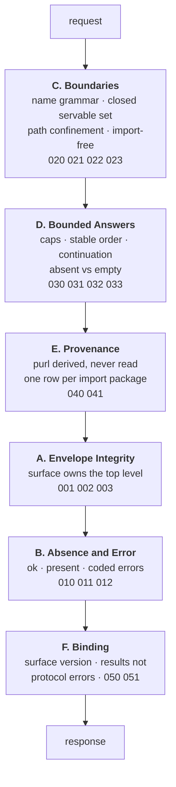

# Miri Standard: Surface Conformance (Consumption)

*Specification Version: 0.3-draft*
*Status: Draft*
*Created: 2026*

## Abstract

The [Discovery Contract](discovery-contract.md) places obligations on two programs. The
[Consumer Conformance](consumer-conformance.md) profile numbers the ones that bind a **consumer** and states plainly
that it does not score the rest. This document is that rest: **eighteen** checks — the IDs are sparse and grouped in
tens by category, so the range below is an address space rather than a count — running from `MIRI-SURFACE-001`
through `MIRI-SURFACE-051`, weighted to 100, defining what a conformant **metadata-query surface** is.

Without it the contract's most load-bearing guarantees — that the envelope cannot be forged, that absence is
distinguishable from failure, that discovery never executes an unvetted package — are normative prose with nothing
verifying them. A reference implementation could regress on every one and no check in this standard would fire.

## Table of Contents

1. [What This Document Is](#1-what-this-document-is)
2. [The Verification Model](#2-the-verification-model)
3. [Scoring Model](#3-scoring-model)
4. [The Checks](#4-the-checks)
5. [Why These Are Not Consumer Checks](#5-why-these-are-not-consumer-checks)
6. [Check Definitions](#6-check-definitions)

---

## 1. What This Document Is

A **surface** is any program that answers the [Discovery Contract §3](discovery-contract.md) operations: the MCP
context server that is the contract's first binding, and any future binding of the same operations over a different
transport. It sits between an installed environment and a consumer, and its job is narrow — read metadata, wrap it,
relay it, and never do anything else.

That narrowness is the point. Most of what this profile checks is the surface **not** doing something: not executing
the package it is describing, not fetching what the package's metadata points at, not merging publisher bytes into
its own namespace, not serving a document outside a closed set, not repairing what it could not parse.

## 2. The Verification Model

A surface, unlike a consumer, has a **specified output**. Every operation's response shape is fixed by §4 of the
contract, so conformance can be checked by issuing a request and inspecting the envelope that comes back — no
judgment about phrasing, no assertion on natural language.

Verification is a **driven suite**, like the consumer profile, but the assertions are exact:

1. Install a fixture from [`examples/fixtures/`](../../examples/fixtures/) into the environment the surface serves.
2. Issue a request — including deliberately hostile ones, which is what a request-trace fixture is for.
3. Assert on the returned envelope against the golden in `examples/fixtures/expected/`.

This is the profile where goldens do the most work: a consumer assertion is necessarily partly about wording, while a
surface assertion is a structural comparison. Where a check below says a field MUST be present or absent, that is
mechanically decidable from one response.

## 3. Scoring Model

Identical to the sibling profiles, so one grading vocabulary spans the standard:

- **Score** = Σ weights of passing checks, over the *effective denominator* (see forfeits below).
- **Level**: **M** (MUST — required for conformance) or **S** (SHOULD — quality signal).
- **Conformance is a gate, not a band.** A program failing any **M** check is **non-conforming**, and a
  non-conforming result carries **no grade** — only the score, capped at 74, to show distance. Grades describe
  conforming programs only.
- **Grade bands (conforming programs only)**: 90–100 **Gold** · 75–89 **Silver** · 50–74 **Bronze**.

**In 0.3-draft every check in this profile is a MUST, so all 100 weight is MUST weight and the bands above are
unreachable: a conforming surface scores exactly 100 and a non-conforming one gets no grade at all.** The bands are
stated anyway, and stated as unreachable rather than quietly listed, because the alternative is a reader computing a
Silver that can never occur. They exist for vocabulary parity with the producer checklists and will become live the
first time this profile gains a SHOULD.

That every obligation here is a MUST is a fact about what a metadata-query surface *is*, not an oversight. A surface
has one job — answer queries in the shape this contract specifies — and there is no partial version of that a
consumer could safely rely on: a surface that forges an envelope field, serves outside the closed set, or paginates
unstably is not a lower-quality surface but an unusable one. The two checks that briefly carried SHOULD
(`031` ordering, `033` continuation) were raised to MUST when a review observed that the Discovery Contract states
both as MUST and that cursor correctness is *defined* in terms of stable ordering — a SHOULD enforcing a MUST is a
gap, and scoring cursor continuation while permitting the unstable ordering that makes continuation meaningless is
a check that cannot fail honestly.

**Forfeits.** A check whose fixture cannot be driven is **forfeited and reported, never silently passed**. A
forfeited check is **excluded from both** the numerator and the denominator — it is removed from the calculation
entirely, not counted as a failure. The score is computed over what was actually exercised, so forfeiting cannot
inflate or deflate it. The report MUST carry the forfeited count and the effective
denominator beside the score, and a forfeited **M** check means **conformance is undetermined** — reported as such,
never as conforming and never as a failure.

## 4. The Checks

Eighteen checks, weights summing to 100. IDs are stable and are never renumbered. Six categories, which follow the
path a request actually takes through a conformant surface:

The ordering is not decorative. A boundary failure admits bytes the later categories then faithfully wrap and
provenance-stamp — so a surface that serves a document outside the servable set has already lost, however impeccable its
envelope is.

### A. Envelope Integrity (20 points)

The surface owns the top level of every response. This is the category the whole anti-forgery argument rests on.

| ID | Level | Check | Weight | Case |
|---|---|---|---|---|
| MIRI-SURFACE-001 | M | Stamps `schema_version` — the string `"1"` in 0.3-draft — on every response | 6 | any |
| MIRI-SURFACE-002 | M | Nests the payload; never merges publisher bytes into the envelope | 8 | `adversarial` (A1/A2) |
| MIRI-SURFACE-003 | M | Emits only the keys reserved by Discovery Contract §4.1 at the top level | 6 | any |

### B. Absence and Error (22 points)

The discrimination the contract calls its single most consequential clause.

| ID | Level | Check | Weight | Case |
|---|---|---|---|---|
| MIRI-SURFACE-010 | M | Reports absence as `ok: true, present: false` — never as an error | 8 | `bare` |
| MIRI-SURFACE-011 | M | Reports failure as `ok: false` with a coded `error` object | 7 | `expected/requests.json` |
| MIRI-SURFACE-012 | M | Reports a document it cannot **parse** as `METADATA_UNREADABLE`, never absent or repaired | 7 | `malformed` |

### C. Boundaries (24 points)

What the surface will and will not do. Every check here is a refusal.

| ID | Level | Check | Weight | Case |
|---|---|---|---|---|
| MIRI-SURFACE-020 | M | Serves only the closed servable set; refuses anything else | 8 | `expected/requests.json` |
| MIRI-SURFACE-021 | M | Confines the resolved path; rejects symlinks and traversal | 8 | `symlinked` |
| MIRI-SURFACE-022 | M | Discovers import-free; executes nothing | 5 | `hostile-import` |
| MIRI-SURFACE-023 | M | Fetches nothing: never resolves a URL found in a served document | 3 | `adversarial` (A7) |

### D. Bounded Answers (16 points)

| ID | Level | Check | Weight | Case |
|---|---|---|---|---|
| MIRI-SURFACE-030 | M | Declares and enforces its caps, and sets `truncated` when it drops content | 6 | `adversarial` (A4) |
| MIRI-SURFACE-031 | M | Orders entries stably across repeated requests | 2 | `adversarial` (A4) |
| MIRI-SURFACE-032 | M | Distinguishes an absent `api-index` from an empty one | 6 | `bare`, `miri` |
| MIRI-SURFACE-033 | M | Offers cursor continuation and rejects an out-of-scope cursor | 2 | `expected/cursor.json` |

### E. Provenance and Identity (11 points)

| ID | Level | Check | Weight | Case |
|---|---|---|---|---|
| MIRI-SURFACE-040 | M | Derives `purl` from the installed distribution; never reads it from a document | 6 | `spoofed` |
| MIRI-SURFACE-041 | M | Emits one row per import package; errors rather than picking among ambiguous ones | 5 | `ambiguous-a` + `ambiguous-b` (A12) |

### F. Binding (7 points)

| ID | Level | Check | Weight | Case |
|---|---|---|---|---|
| MIRI-SURFACE-050 | M | Advertises the surface version at its binding's normative path — for MCP, `capabilities.miri.surface_version` in `initialize` (Discovery Contract §6.3) | 4 | any |
| MIRI-SURFACE-051 | M | Carries absence and error as tool results, never as protocol errors | 3 | `bare`, `expected/requests.json` |

### Category Summary

| Category | Checks | Points |
|---|---|---|
| A. Envelope Integrity | 3 | 20 |
| B. Absence and Error | 3 | 22 |
| C. Boundaries | 4 | 24 |
| D. Bounded Answers | 4 | 16 |
| E. Provenance and Identity | 2 | 11 |
| F. Binding | 2 | 7 |
| **Total** | **18** | **100** |

**All eighteen checks now have an executable case.** The fixtures those cases name — the `malformed` variant, the
`symlinked` document, the import canary, the `spoofed` identity document, the `consuming-project` declarations and
the request-trace set — were built after this profile, precisely because the profile is what made clear which cases
were missing. `tools/validate_fixtures.py` asserts each stays live.

The last of them was **multi-distribution** (`MIRI-SURFACE-041`, one row per import package and
`AMBIGUOUS_PACKAGE`), which needs two distributions providing one import name and so could not be a variant of a
fixture set built from a single template. It was carried as defined-but-not-scorable until a review pointed out what
that actually cost: `041` is a **MUST**, so by §3's rule every run forfeiting it reported conformance **undetermined**
and emitted no grade — the profile could never grade anything, permanently, on paper. The answer was to build the
case (`ambiguous-a` and `ambiguous-b`, two distributions both providing `greet_ambiguous`, sharing the template
source so the collision is the only variable) rather than to write more prose about the gap. **Every check in this
profile now has a case a suite can drive.**

## 5. Why These Are Not Consumer Checks

It would be simpler to keep one profile. The split exists because the two programs fail differently, and a single
score would obscure which one is broken.

A consumer emits no responses, so it cannot be held to the shape of one. A surface makes no decisions about what to
call, so it cannot be held to the judgment a consumer exercises. Scoring them together would produce a number that
answers neither "can I trust this server" nor "can I trust this agent" — and when it dropped, would not say which.

The division follows the actor table in [Consumer Conformance §4](consumer-conformance.md): every obligation marked
there as binding the **Surface** is numbered here, and every category in §4 appears in that table. The one obligation
named on both sides is absence — a surface must *signal* it correctly and a consumer must *report* it correctly,
which are different failures that can occur independently. That table was written as a declared gap; this document
closes it.

## 6. Check Definitions

The authoritative definition of each check is its YAML file in `standards/consumption/checks/`, governed by
`schemas/check-v1.json` with `target: surface`. The tables in §4 are the derived rendering: where the two disagree,
the YAML is correct.

Surface and consumer checks share a directory because they share a suite and a contract; they are separated by
`target`, and their weights sum to 100 independently.
