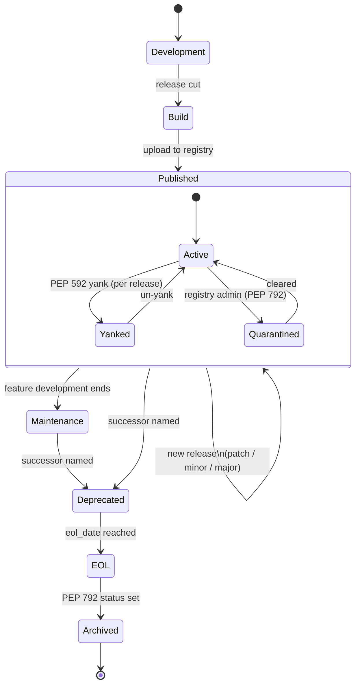
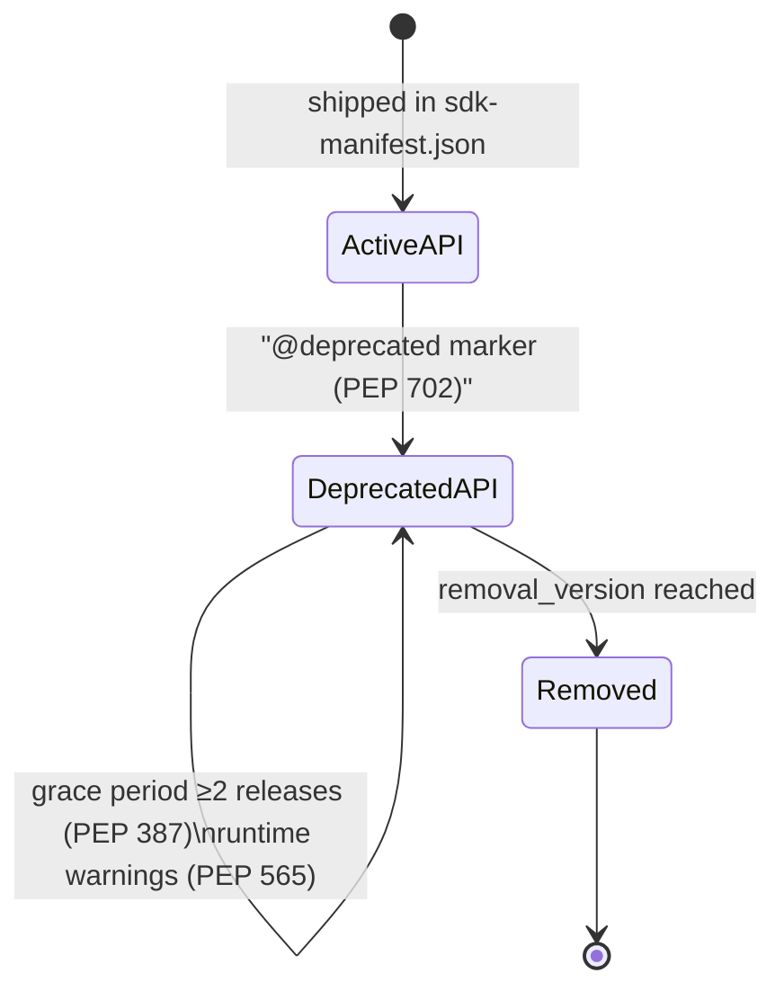

# Miri Artifact Lifecycle: Python Wheels

*Specification Version: 0.1-draft*
*Status: Draft*
*Created: 2026*

## Overview

Every stage a Miri-compliant Python package moves through, from first build to end-of-life — with the metadata state
each stage requires, the signal consumers see, and the standard each transition derives from. Two state machines
compose: the **artifact lifecycle** (the package as a whole) and, nested inside its active years, the **interface
lifecycle** (individual APIs deprecating independently — see [Lifecycle Spec §6](lifecycle-security-metadata.md)).

## The Artifact Lifecycle

## Stage Definitions

| Stage | `support.status` | What happens to metadata | What consumers see | Standards |
|---|---|---|---|---|
| **1. Development** | — (unpublished) | Code carries `@deprecated` markers as APIs evolve; schemas authored as data | Nothing — not yet published | [PEP 702](https://peps.python.org/pep-0702/) |
| **2. Build & Attest** | `active` | Build generates all `agent-metadata/` files (sdk-manifest, usage-patterns, migration-guide from PEP 702 markers, lifecycle.json); PEP 770 SBOM if bundling non-Python components; linter scores the wheel; attestations attached | The Miri score gates release in CI | [Agent Metadata §5](miri-agent-metadata-specification.md) / [PEP 770](https://peps.python.org/pep-0770/) / [PEP 740](https://peps.python.org/pep-0740/) / [Checklist](linter-checklist.md) |
| **3. Published (Active)** | `active` | Registry serves the release; `update_check` answers "latest"; advisories attach via OSV as discovered; each new release regenerates metadata and appends migration-guide entries | Full Miri surface: identity, advisory join, update state, examples | [Lifecycle §3–4](lifecycle-security-metadata.md) / [OSV](https://ossf.github.io/osv-schema/) |
| **4. Maintenance** | `maintenance` | Security fixes only; `supported_versions` narrows; deprecations accumulate ahead of the successor | Agents see reduced-support signal *before* choosing the package | [Lifecycle §3.1](lifecycle-security-metadata.md) |
| **5. Deprecated** | `deprecated` | `replacement` purl set; final releases carry updated `support`; migration-guide documents the path out | Every future install carries the successor pointer — no README reading required | [Lifecycle §4.3](lifecycle-security-metadata.md) |
| **6. EOL** | `eol` | `eol_date` passed; last release is terminal; advisories may still be filed against it | Consumers treat any use as a finding; OpenEoX statement once ratified | [Lifecycle §3.3](lifecycle-security-metadata.md) / [OpenEoX](https://www.oasis-open.org/tc-openeox/) |
| **7. Archived** | `eol` | PEP 792 `archived` marker set at the registry; project read-only | Index APIs signal archived state to all tooling | [PEP 792](https://peps.python.org/pep-0792/) |

## Cross-Cutting Events (any published stage)

| Event | Mechanism | Effect | Standards |
|---|---|---|---|
| **Advisory published** | Maintainer files GHSA / PYSEC record → flows to OSV | Every consumer's `advisory_sources` join now flags affected versions; `fixed` version names the remedy | [Lifecycle §4.2](lifecycle-security-metadata.md) / [OSV](https://ossf.github.io/osv-schema/) |
| **Release yanked** | [PEP 592](https://peps.python.org/pep-0592/) | Version leaves dependency resolution; pinned installs still work | PEP 592 |
| **Project quarantined** | Registry administrators | Entire project uninstallable until cleared | [PEP 792](https://peps.python.org/pep-0792/) |
| **VEX statement** | OpenVEX / CycloneDX VEX document at `vex` URL | "Affected but not exploitable" suppressions, auditable | [OpenVEX](https://github.com/openvex/spec) |

## The Nested Interface Lifecycle

Inside stages 3–5, individual APIs move through their own three-state machine:

Transition requirements (enforced by [coherence checks MIRI-PY-028…035](linter-checklist.md)):

1. **Active → Deprecated**: `@deprecated` marker added ([PEP 702](https://peps.python.org/pep-0702/)); build extracts it
   into `migration-guide.json` with `replacement` and `removal_version`; runtime `DeprecationWarning` fires ([PEP
   565](https://peps.python.org/pep-0565/)).
2. **Deprecated (holding)**: survives ≥2 releases ([PEP 387](https://peps.python.org/pep-0387/) shape); every release's
   migration-guide keeps the entry.
3. **Deprecated → Removed**: only at/after `removal_version`; the replacement must exist in the new `sdk-manifest.json`.
   **Removal without a prior Deprecated state is a conformance failure** (no silent removals, MIRI-PY-030).

## The Three Clocks

Throughout the lifecycle, three versions advance independently (see [Landscape §5](../cli/landscape-and-prior-art.md)):
the **package version** (PEP 440), the **Miri metadata format version** (`miri_lifecycle_version`, schema `$id` s), and
— for packages fronting services — the **backing API version**. Collapsing any two loses the ability to change one
without a major bump in the other.

## PDF

A diagrammed PDF rendering is committed at
[assets/miri-python-artifact-lifecycle.pdf](../../assets/miri-python-artifact-lifecycle.pdf). This markdown is the
source of truth; regenerate the PDF when it changes.

## Companion

- [CLI Artifact Lifecycle](../cli/artifact-lifecycle.md)
